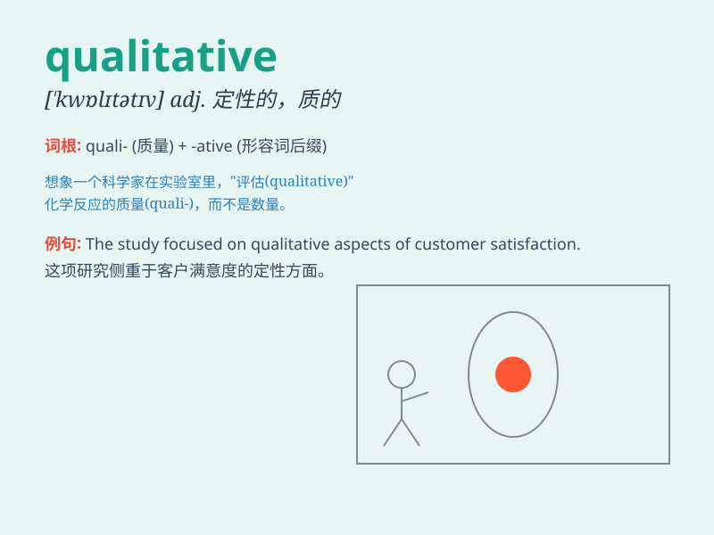

## qualitative

**英音:** _[\'kwɒlɪtətɪv]_ **美音:** _[\'kwɑlətetɪv]_

**译义:** *adj.性质上的,定性的*

### 短语

+ **qualitative analysis:** _定性分析_

+ **qualitative research:** _定性研究_

+ **qualitative change:** _质变_

+ **qualitative data:** _定性数据_

+ **qualitative improvement:** _质量上的改进_

### 例句

#### 例句1

> **The qualitative research provided valuable insights into the
problem.**

**中文翻译:** 定性研究为该问题提供了宝贵的见解。

**单词释义:** 定性的

#### 例句2

> **There is a qualitative difference between the two products.**

**中文翻译:** 两种产品之间存在质的差异。

**单词释义:** 性质上的

#### 例句3

> **We need to conduct a qualitative analysis of the data.**

**中文翻译:** 我们需要对数据进行定性分析。

**单词释义:** 定性的

### 背诵小故事

> A scientist was doing research. He focused not on the quantity but on
the qualitative aspects. He cared about the nature and quality of the
data, which led to a breakthrough. Remember, qualitative means related
to quality.

**一位科学家正在做研究。他关注的不是数量，而是定性方面。他关心数据的性质和质量，这带来了突破。记住，qualitative
意思是与质量有关的。**

### 图义

