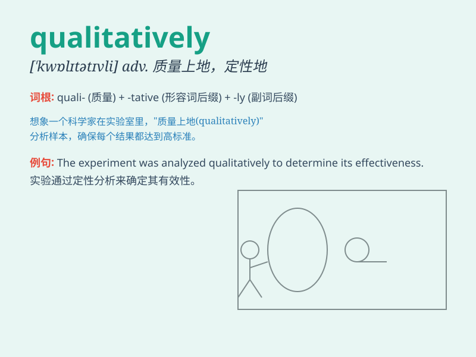

## qualitatively

**英音:** _[\'kwɒlɪtətɪvli]_ **美音:**
_[\'kwɒlɪtətɪvli]_

**译义:** *adv.质量上*

### 短语

+ **qualitatively different:** _性质上不同_

+ **qualitatively superior:** _质量上优越_

+ **qualitatively analyze:** _定性分析_

+ **qualitatively assess:** _定性评估_

+ **qualitatively change:** _质的变化_

### 例句

#### 例句1

> **The new product is qualitatively superior to the old one.**

**中文翻译:** 新产品在质量上优于旧产品。

**单词释义:** 在质量方面

#### 例句2

> **The research has qualitatively changed our understanding of the
phenomenon.**

**中文翻译:** 这项研究从质上改变了我们对这一现象的理解。

**单词释义:** 从性质上

#### 例句3

> **The service provided by this company is qualitatively different
from its competitors.**

**中文翻译:** 该公司提供的服务与竞争对手有质的不同。

**单词释义:** 在质量上

### 背诵小故事

> A scientist was studying a new material. He found that it changed not
just quantitatively but also qualitatively. The color, texture, and
properties all transformed in a unique way. This showed the importance
of looking at things qualitatively.

**一位科学家正在研究一种新材料。他发现它不仅在数量上有变化，而且在性质上也有变化。颜色、质地和特性都以独特的方式改变了。这表明了从性质上看待事物的重要性。**

### 图义

