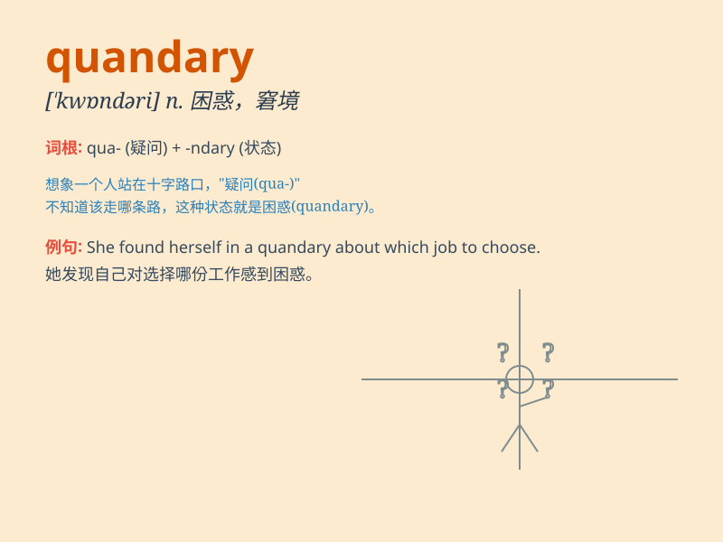

## quandary

**英音:** _[\'kwɒnd(ə)rɪ]_ **美音:** _[\'kwɑndəri]_

**译义:** *n.困惑,窘境,进退两难*

### 短语

+ **in a quandary:** _处于困境；左右为难_

+ **put someone in a quandary:** _使某人陷入困境_

+ **find oneself in a quandary:** _发现自己处于困境_

+ **get out of a quandary:** _摆脱困境_

+ **be in a serious quandary:** _处于严重的困境_

### 例句

#### 例句1

> **I\'m in a quandary about whether to accept the job offer or
not.**

**中文翻译:** 我对于是否接受这份工作感到左右为难。

**单词释义:** 左右为难的处境

#### 例句2

> **She found herself in a quandary when she lost her keys and
couldn\'t get into the house.**

**中文翻译:**
当她丢了钥匙并且无法进屋时，她发现自己陷入了进退两难的境地。

**单词释义:** 困境

#### 例句3

> **The company is in a quandary over how to increase profits without
sacrificing quality.**

**中文翻译:** 该公司面临着如何在不牺牲质量的情况下增加利润的困境。

**单词释义:** 困惑的局面

### 背诵小故事

> One day, Tom was in a quandary. He had to choose between two jobs,
one with high pay but long hours, and the other with less pay but more
leisure time. He didn\'t know which to pick and felt very confused.

**有一天，汤姆陷入了困境。他必须在两份工作之间做出选择，一份工资高但工作时间长，另一份工资低但休闲时间多。他不知道选哪个，感到非常困惑。**

### 图义

