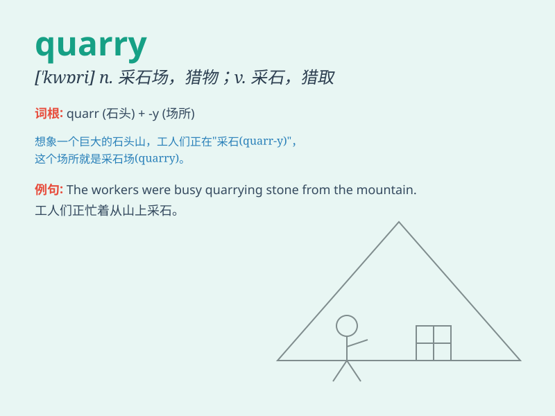

## quarry

**英音:** _[\'kwɒrɪ]_ **美音:** _[\'kwɔri]_

**译义:**
*n.采石场,(知识、消息等的)来源vt.挖出,苦心找出vi.费力地找*

### 短语

+ **quarry tile:** _缸砖；方砖_

+ **quarry face:** _采石场采掘面_

+ **quarry water:** _矿坑水_

+ **quarry owner:** _采石场场主_

+ **quarry worker:** _采石工人_

### 例句

#### 例句1

> **The workers were blasting in the quarry to extract stone.**

**中文翻译:** 工人们正在采石场爆破开采石头。

**单词释义:** 采石场

#### 例句2

> **The detective was quarrying the suspect for information.**

**中文翻译:** 侦探正在向嫌疑人打探情报。

**单词释义:** 追问；盘问

#### 例句3

> **The lion was quarrying its prey in the jungle.**

**中文翻译:** 狮子正在丛林中猎取猎物。

**单词释义:** 追逐；追捕

### 背诵小故事

> A brave adventurer was lost in a forest and found a quarry. There
were huge stones and workers cutting them. The adventurer realized the
quarry was a place to extract stones. He finally found his way out with
this clue.

**一位勇敢的冒险家在森林中迷路，发现了一个采石场。那里有巨大的石头和正在切割它们的工人。冒险家意识到采石场是开采石头的地方。他最终凭借这个线索找到了出路。**

### 图义

