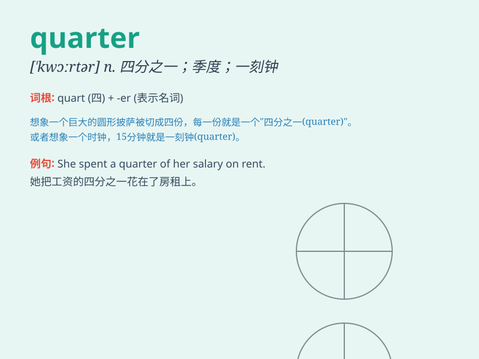

## quarter

**英音:** _[\'kwɔːtə]_ **美音:** _[\'kwɔrtɚ]_

**译义:** *n.四分之一,[常 pl.] 方向,地区,方面,季,季度,一刻钟
num.四分之一,刻*

### 短语

+ **a quarter past:** _一刻钟过_

+ **a quarter to:** _差一刻钟_

+ **first quarter:** _第一季度_

+ **last quarter:** _上一季度_

+ **quarter finals:** _四分之一决赛_

### 例句

#### 例句1

> **A quarter of the students in the class are from abroad.**

**中文翻译:** 班上四分之一的学生来自国外。

**单词释义:** 四分之一

#### 例句2

> **The clock struck a quarter past six.**

**中文翻译:** 时钟敲响了六点一刻。

**单词释义:** 一刻钟

#### 例句3

> **The town is divided into four quarters.**

**中文翻译:** 该镇分为四个区。

**单词释义:** 区域；部分

### 背诵小故事

> A mouse was running in a big house. It found a quarter of a big
cheese in a corner. It was so happy and took it home quickly.

**一只老鼠在一个大房子里跑。它在一个角落里发现了四分之一块大奶酪。它非常高兴，很快就把它带回家了。**

### 图义

