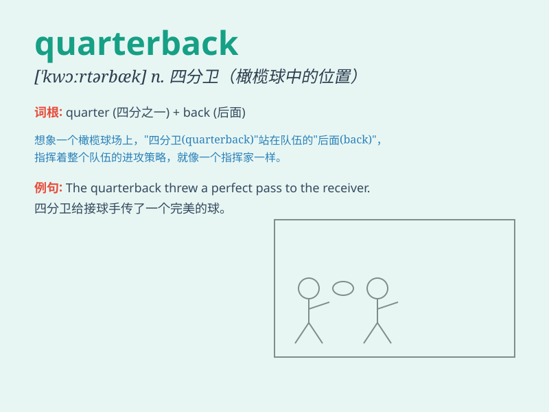

## quarterback

**英音:** _[\'kwɔːtəbæk]_ **美音:** _[\'kwɔrtɚbæk]_

**译义:** *n.[橄榄球] 四分卫vi.担任四分卫*

### 短语

+ **starting quarterback:** _首发四分卫_

+ **backup quarterback:** _替补四分卫_

+ **pro quarterback:** _职业四分卫_

+ **college quarterback:** _大学四分卫_

+ **all-star quarterback:** _全明星四分卫_

### 例句

#### 例句1

> **The quarterback threw a perfect pass to the receiver.**

**中文翻译:** 四分卫向接球手完美传球。

**单词释义:** 四分卫

#### 例句2

> **He dreams of becoming a professional quarterback one day.**

**中文翻译:** 他梦想有一天成为一名职业四分卫。

**单词释义:** 四分卫

#### 例句3

> **The quarterback led the team to victory in the final game.**

**中文翻译:** 这位四分卫带领球队在最后一场比赛中取得了胜利。

**单词释义:** 四分卫

### 背诵小故事

> 想象一场激烈的橄榄球比赛，球队的核心人物就是 quarterback
。他在每一个四分之一场（quarter）都掌控全局、指挥进攻，就像战场上的将军，带领队伍冲向胜利。

**（美式橄榄球的）四分卫**

### 图义

