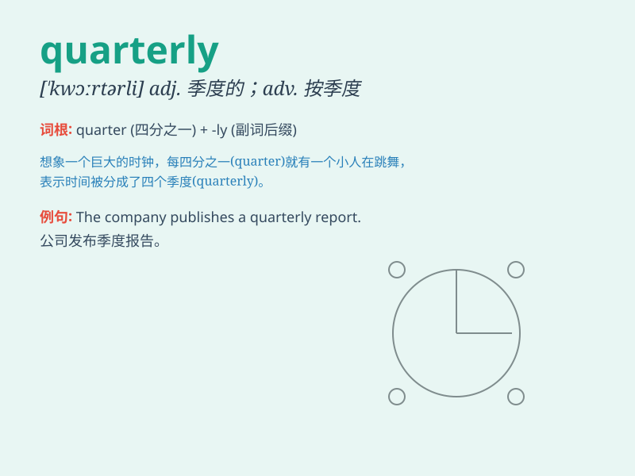

## quarterly

**英音:** _[\'kwɔːtəlɪ]_ **美音:** _[\'kwɔrtɚli]_

**译义:** *n.季刊adj.一年四次的,每季的adv.每季地*

### 短语

+ **quarterly report:** _季度报告_

+ **quarterly earnings:** _季度收益_

+ **quarterly meeting:** _季度会议_

+ **quarterly review:** _季度审查_

+ **quarterly payment:** _季度付款_

### 例句

#### 例句1

> **The company releases its quarterly financial report next
week.**

**中文翻译:** 该公司下周将发布季度财务报告。

**单词释义:** 季度的

#### 例句2

> **She subscribes to a quarterly magazine on fashion.**

**中文翻译:** 她订阅了一本时尚季刊。

**单词释义:** 季度的

#### 例句3

> **The rent is payable quarterly.**

**中文翻译:** 租金按季度支付。

**单词释义:** 季度地

### 背诵小故事

> A company had a big meeting quarterly. At these meetings, they
checked how they did every three months. It was like a special time to
see if they were on the right track.

**一家公司每季度都会开一次大型会议。在这些会议上，他们每三个月检查一次业绩。这就像是一个特殊的时刻，看看他们是否走在正确的道路上。**

### 图义

