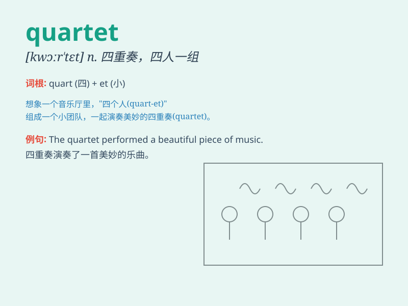

## quartet

**英音:** _[kwɔː\'tet]_ **美音:** _[kwɔr\'tɛt]_

**译义:** *n.四重奏,四重唱,四部合奏(唱)曲*

### 短语

+ **string quartet:** _弦乐四重奏_

+ **quartet of players:** _四人组的选手_

+ **vocal quartet:** _声乐四重唱_

+ **quartet performance:** _四重奏表演_

+ **jazz quartet:** _爵士四重奏_

### 例句

#### 例句1

> **The string quartet gave a wonderful performance last night.**

**中文翻译:** 弦乐四重奏昨晚进行了精彩的表演。

**单词释义:** 四重奏；四重唱

#### 例句2

> **The quartet of friends always goes on adventures together.**

**中文翻译:** 四位朋友总是一起去冒险。

**单词释义:** 四个一组；四人一组

#### 例句3

> **The tennis quartet won the championship.**

**中文翻译:** 网球四重奏获得了冠军。

**单词释义:** 四人组合

### 背诵小故事

> Four musicians were invited to a party. They formed a quartet and
played beautiful music together. The audience was charmed by their
performance. Remember, a quartet is a group of four people or things.

**四位音乐家被邀请参加一个聚会。他们组成了一个四重奏组合，一起演奏了美妙的音乐。观众被他们的表演所吸引。记住，quartet
是指四人一组或四件一套。**

### 图义

