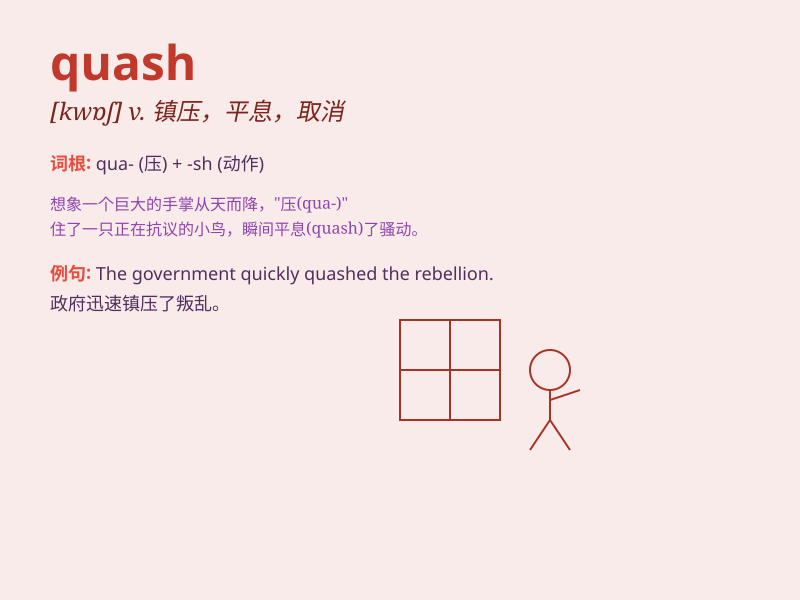

## quash

**英音:** _[kwɒʃ]_ **美音:** _[kwɑʃ]_

**译义:** *v.取消*

### 短语

+ **quash a rebellion:** _镇压叛乱_

+ **quash a rumor:** _辟谣_

+ **quash an appeal:** _驳回上诉_

+ **quash hopes:** _破灭希望_

+ **quash opposition:** _压制反对_

### 例句

#### 例句1

> **The judge quashed the verdict of the lower court.**

**中文翻译:** 法官撤销了下级法院的判决。

**单词释义:** 撤销；废止

#### 例句2

> **He managed to quash the rumors before they spread further.**

**中文翻译:** 他设法在谣言进一步传播之前将其平息。

**单词释义:** 平息；镇压

#### 例句3

> **The government\'s efforts to quash the rebellion were
unsuccessful.**

**中文翻译:** 政府镇压叛乱的努力没有成功。

**单词释义:** 镇压；平息

### 背诵小故事

> A king wanted to quash the rebellion of his subjects. The rebels were
strong, but the king\'s army was stronger. Finally, the king managed to
quash the rebellion and restore peace to his kingdom.

**一位国王想要镇压他臣民的叛乱。叛军很强大，但国王的军队更强大。最终，国王成功镇压了叛乱，使他的王国恢复了和平。**

### 图义

