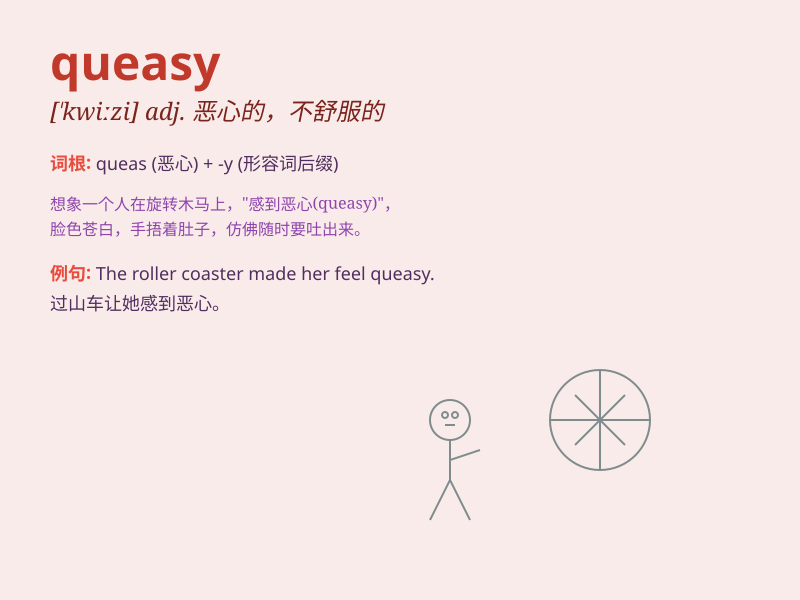

## queasy

**英音:** _[\'kwiːzɪ]_ **美音:** _[\'kwizi]_

**译义:** *adj.不稳定的*

### 短语

+ **feel queasy:** _感到恶心_

+ **queasy stomach:** _胃不舒服_

+ **queasy sensation:** _令人不适的感觉_

+ **queasy feeling:** _恶心的感觉_

+ **become queasy:** _变得恶心_

### 例句

#### 例句1

> **I felt queasy after riding the roller coaster.**

**中文翻译:** 坐过山车后我感到恶心。

**单词释义:** 恶心的；欲吐的

#### 例句2

> **The smell of the fish made her queasy.**

**中文翻译:** 鱼的味道让她感到恶心。

**单词释义:** 感到恶心的

#### 例句3

> **He got queasy when he saw the blood.**

**中文翻译:** 当他看到血时，他感到恶心。

**单词释义:** 不舒服的；不安的

### 背诵小故事

> One day, I ate some bad food and felt queasy. My stomach was churning
and I had no energy. It was a terrible feeling. Just remember my queasy
experience when you think of this word.

**有一天，我吃了些变质的食物，感觉恶心。我的胃在翻腾，浑身没力气。那种感觉糟透了。当你想到这个单词时，就记住我的恶心经历。**

### 图义

