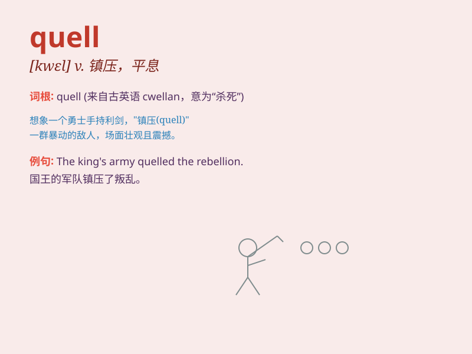

## quell

**英音:** _[kwel]_ **美音:** _[kwɛl]_

**译义:** *v.镇压*

### 短语

+ **quell fears:** _消除恐惧_

+ **quell unrest:** _平息动乱_

+ **quell rumors:** _制止谣言_

+ **quell anger:** _压制怒火_

+ **quell rebellion:** _镇压叛乱_

### 例句

#### 例句1

> **The police managed to quell the riot.**

**中文翻译:** 警方成功平息了骚乱。

**单词释义:** 平息；镇压

#### 例句2

> **She tried to quell her fears.**

**中文翻译:** 她试图平息自己的恐惧。

**单词释义:** 消除；减轻

#### 例句3

> **His words managed to quell the rumors.**

**中文翻译:** 他的话平息了谣言。

**单词释义:** 制止；遏制

### 背诵小故事

> A wildfire was spreading rapidly, causing panic. But the brave
firefighters worked hard and finally quelled the fire. They stopped the
fire from causing more damage. So, \'quell\' means to stop or suppress
something forcefully.

**一场野火迅速蔓延，引起恐慌。但勇敢的消防员努力工作，最终扑灭了大火。他们强行阻止了火势造成更多破坏。所以，'quell'意思是用力制止或压制某事。**

### 图义

