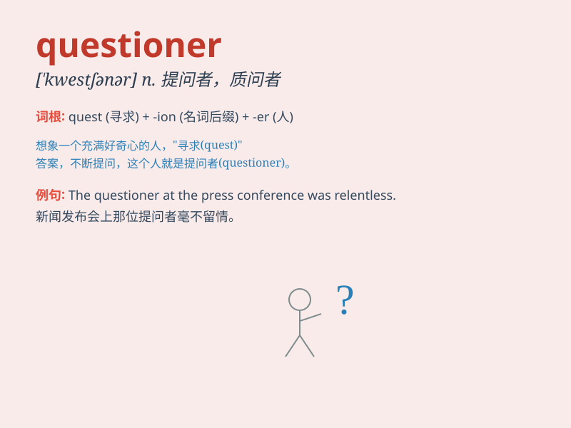

## questioner

**英音:** _[ˈkwestʃənə(r)]_ **美音:** _[ˈkwestʃənər]_

**译义:** *n.质问者,发问者*

### 短语

+ **skilled questioner:** _熟练的提问者_

+ **aggressive questioner:** _激进的提问者_

+ **persistent questioner:** _坚持不懈的提问者_

+ **curious questioner:** _好奇的提问者_

+ **experienced questioner:** _经验丰富的提问者_

### 例句

#### 例句1

> **The questioner was persistent in seeking clear answers.**

**中文翻译:** 提问者坚持不懈地寻求明确的答案。

**单词释义:** 提问者

#### 例句2

> **The experienced questioner knew exactly how to challenge the
speaker.**

**中文翻译:** 经验丰富的提问者清楚地知道如何挑战演讲者。

**单词释义:** 提问者

#### 例句3

> **The questioner\'s sharp inquiries kept the panel on their
toes.**

**中文翻译:** 提问者尖锐的询问让专家组保持警惕。

**单词释义:** 提问者

### 背诵小故事

> A curious little monkey became a questioner. It always asked why the
sky was blue and why the fruits were sweet. Everyone loved its
inquisitive spirit.

**一只好奇的小猴子变成了提问者。它总是问为什么天空是蓝色的，为什么水果是甜的。大家都喜欢它的好奇精神。**

### 图义

