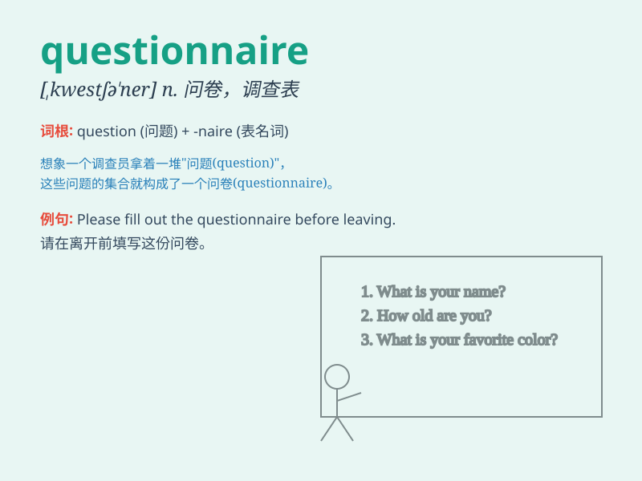

## questionnaire

**英音:** _[ˌkwestʃəˈneə(r)]_ **美音:** _[ˌkwɛstʃəˈnɛr]_

**译义:** *n.调查表,问卷*

### 短语

+ **fill out a questionnaire:** _填写问卷_

+ **design a questionnaire:** _设计问卷_

+ **distribute a questionnaire:** _分发问卷_

+ **analyze a questionnaire:** _分析问卷_

+ **respond to a questionnaire:** _回答问卷_

### 例句

#### 例句1

> **We need to fill out this questionnaire before the deadline.**

**中文翻译:** 我们需要在截止日期之前填写这份调查问卷。

**单词释义:** 调查问卷

#### 例句2

> **The questionnaire aims to collect information about your shopping
habits.**

**中文翻译:** 该调查问卷旨在收集有关您的购物习惯的信息。

**单词释义:** 调查问卷

#### 例句3

> **The results of the questionnaire will help us improve our
services.**

**中文翻译:** 调查问卷的结果将有助于我们改进我们的服务。

**单词释义:** 调查问卷

### 背诵小故事

>
想象一下，一位侦探正在调查一个神秘案件。他手里拿着一叠questionnaire（调查问卷），准备去询问证人，获取关键线索来解开谜团。

**想象一位侦探拿着调查问卷准备询问证人以获取线索来解开谜团**

### 图义

