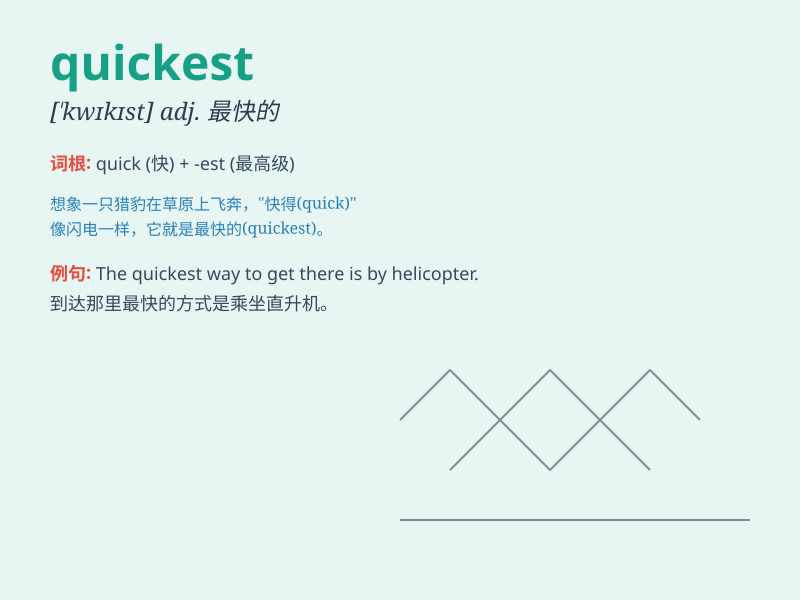

## quickest

**英音:** _[ˈkwɪkɪst]_ **美音:** _[ˈkwɪkɪst]_

**译义:** *adj.最快的；最迅速的（quick的最高级）*

### 短语

+ **the quickest way:** _最快的方式_

+ **quickest route:** _最快的路线_

+ **quickest solution:** _最快的解决办法_

+ **quickest response:** _最快的回应_

+ **quickest learner:** _学得最快的人_

### 例句

#### 例句1

> **He is the quickest runner in the team.**

**中文翻译:** 他是队里跑得最快的跑步者。

**单词释义:** 最快的

#### 例句2

> **This is the quickest way to solve the problem.**

**中文翻译:** 这是解决这个问题最快的方法。

**单词释义:** 最快的

#### 例句3

> **She finished the test in the quickest time.**

**中文翻译:** 她在最短的时间内完成了测试。

**单词释义:** 最快的；最短的

### 背诵小故事

> A rabbit was in a race. It moved very fast and was the quickest among
all the animals. It reached the finish line before anyone else. Its
speed was amazing!

**一只兔子在赛跑。它跑得非常快，是所有动物中最快的。它比其他任何动物都先到达终点线。它的速度令人惊叹！**

### 图义

