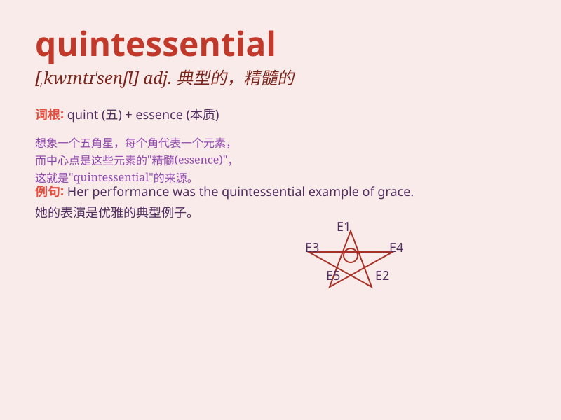

## quintessential

**英音:** _[,kwɪntɪ\'senʃ(ə)l]_ **美音:**
_[,kwɪntɪ\'sɛnʃəl]_

**译义:** *adj.精萃的,精髓的*

### 短语

+ **quintessential example:** _典型的例子_

+ **quintessential quality:** _本质的品质_

+ **quintessential feature:** _典型特征_

+ **quintessential element:** _基本要素_

+ **quintessential beauty:** _极致之美_

### 例句

#### 例句1

> **The small town is quintessential of rural America.**

**中文翻译:** 这个小镇是美国乡村的典型代表。

**单词释义:** 典型的；精髓的

#### 例句2

> **This dish is the quintessential example of French cuisine.**

**中文翻译:** 这道菜是法国菜的典型范例。

**单词释义:** 典型的；精髓的

#### 例句3

> **He embodies the quintessential traits of a successful leader.**

**中文翻译:** 他体现了成功领导者的典型特质。

**单词释义:** 典型的；精髓的

### 背诵小故事

> A young artist was on a quest to create the quintessential
masterpiece. After many attempts and facing numerous challenges, he
finally achieved it. The masterpiece captured the essence of beauty and
art.

**一位年轻的艺术家正在寻求创作最典型的杰作。经过多次尝试和面对众多挑战，他终于做到了。这幅杰作捕捉到了美与艺术的精髓。**

### 图义

