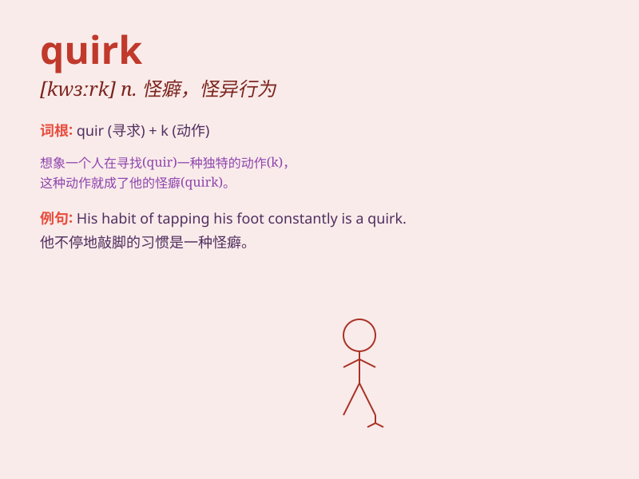

## quirk

**英音:** _[kwɜːk]_ **美音:** _[kwɝk]_

**译义:** *n.急转,遁词,怪癖*

### 短语

+ **character quirk:** _性格怪癖_

+ **linguistic quirk:** _语言上的怪异之处_

+ **a quirk of fate:** _命运的捉弄_

+ **facial quirk:** _面部怪相_

+ **behavioral quirk:** _行为怪癖_

### 例句

#### 例句1

> **One of her quirks is that she always wears red shoes.**

**中文翻译:** 她的怪癖之一是总是穿红色的鞋子。

**单词释义:** 怪癖；怪异的性格特点

#### 例句2

> **The machine has a quirk that causes it to malfunction
sometimes.**

**中文翻译:** 这台机器有个毛病，有时会出故障。

**单词释义:** 毛病；怪异之处

#### 例句3

> **His smile had a quirk that made it seem mysterious.**

**中文翻译:** 他的微笑有一种怪异，使它看起来很神秘。

**单词释义:** 奇特之处；怪异的表情

### 背诵小故事

> A quirky artist always had a strange quirk. He loved to paint using
only his feet. One day, his quirk made him famous. People were amazed by
his unique style.

**一位古怪的艺术家总是有一个奇怪的怪癖。他喜欢只用脚画画。有一天，他的怪癖使他出名了。人们对他独特的风格感到惊讶。**

### 图义

