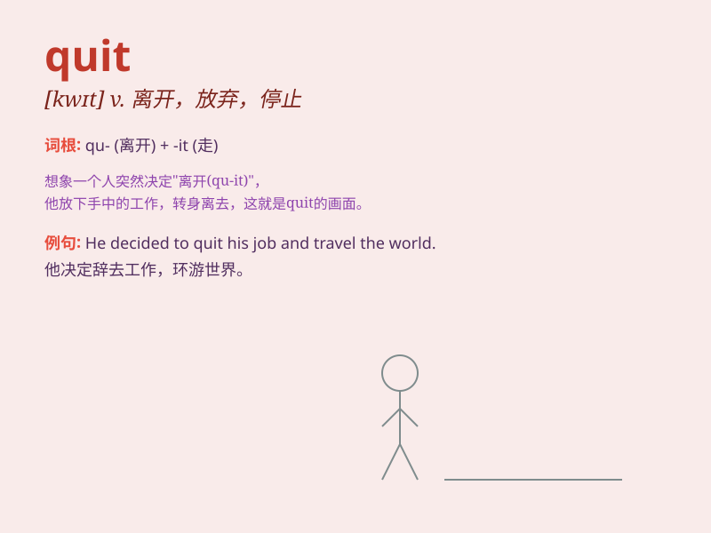

## quit

**英音:** _[kwɪt]_ **美音:** _[kwɪt]_

**译义:** *vi.离开,辞职,停止vt.离开,放弃,解除,停止*

### 短语

+ **quit doing sth:** _停止做某事_

+ **quit smoking:** _戒烟_

+ **quit school:** _退学_

+ **quit one\'s job:** _辞职_

+ **quit the habit:** _戒除习惯_

### 例句

#### 例句1

> **I decided to quit smoking last year.**

**中文翻译:** 我去年决定戒烟。

**单词释义:** 放弃，戒除

#### 例句2

> **He quit his job because of the low salary.**

**中文翻译:** 因为工资低，他辞去了工作。

**单词释义:** 辞去，离开（工作职位等）

#### 例句3

> **The students quit the classroom one by one after class.**

**中文翻译:** 下课后学生们一个接一个地离开教室。

**单词释义:** 离开，退出（某处）

### 背诵小故事

> A hardworking ant was always busy carrying food. One day, it felt too
tired and decided to quit. It said to itself, \'I need a rest.\' So,
\'quit\' means to stop doing something.

**一只勤劳的蚂蚁总是忙着搬运食物。有一天，它感觉太累了，决定放弃。它对自己说：'我需要休息。'所以，'quit'意思是停止做某事。**

### 图义

