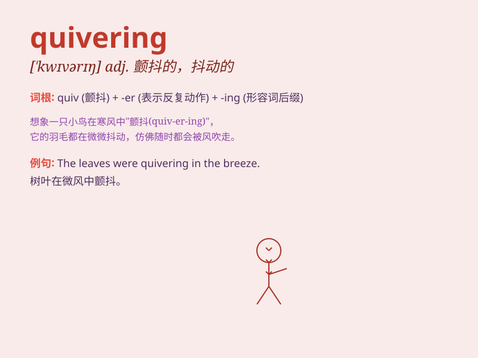

## quivering

**英音:** _[ˈkwɪvərɪŋ]_ **美音:** _[ˈkwɪvərɪŋ]_

**译义:** *adj.颤抖的，颤动的；n.颤抖，颤动*

### 短语

+ **quivering lip:** _颤抖的嘴唇_

+ **quivering voice:** _颤抖的声音_

+ **quivering hands:** _颤抖的双手_

+ **quivering leaf:** _颤抖的树叶_

+ **quivering body:** _颤抖的身体_

### 例句

#### 例句1

> **The bird was quivering with fear on the branch.**

**中文翻译:** 这只鸟在树枝上因恐惧而颤抖。

**单词释义:** 颤抖

#### 例句2

> **She held the quivering pen in her hand, unable to write.**

**中文翻译:** 她手里握着颤抖的笔，无法书写。

**单词释义:** 颤抖的

#### 例句3

> **His voice was quivering as he told the story.**

**中文翻译:** 他讲故事时声音颤抖。

**单词释义:** 颤抖

### 背诵小故事

> A little bird was standing on a branch, quivering in the cold wind.
Its feathers were shaking, and it looked very scared. Just then, a kind
girl came and covered it with a warm blanket. The bird stopped quivering
and felt safe.

**一只小鸟站在树枝上，在寒风中颤抖。它的羽毛抖动着，看起来非常害怕。就在这时，一个善良的女孩过来，用温暖的毯子盖住了它。小鸟不再颤抖，感到安全了。**

### 图义

