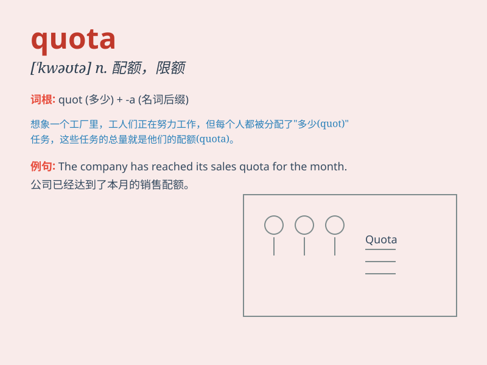

## quota

**英音:** _[\'kwəʊtə]_ **美音:** _[\'kwotə]_

**译义:** *n.配额,限额*

### 短语

+ **import quota:** _进口配额_

+ **export quota:** _出口配额_

+ **production quota:** _生产配额_

+ **sales quota:** _销售配额_

+ **quota system:** _配额制度_

### 例句

#### 例句1

> **The company has reached its sales quota for this month.**

**中文翻译:** 这家公司已经达到了本月的销售配额。

**单词释义:** 配额；定额

#### 例句2

> **Each department has a specific quota of new hires.**

**中文翻译:** 每个部门都有特定的新员工招聘配额。

**单词释义:** 配额

#### 例句3

> **The import quota on these goods has been reduced.**

**中文翻译:** 这些商品的进口配额已经减少了。

**单词释义:** 配额；限额

### 背诵小故事

> A factory had a quota of 1000 products to make each day. Workers had
to work hard to meet this number. \'Quota\' means a fixed number or
amount that must be achieved or dealt with.

**一家工厂每天有 1000
件产品的生产配额。工人们必须努力工作以达到这个数量。\'quota\'意思是必须达到或处理的固定数量或额度。**

### 图义

