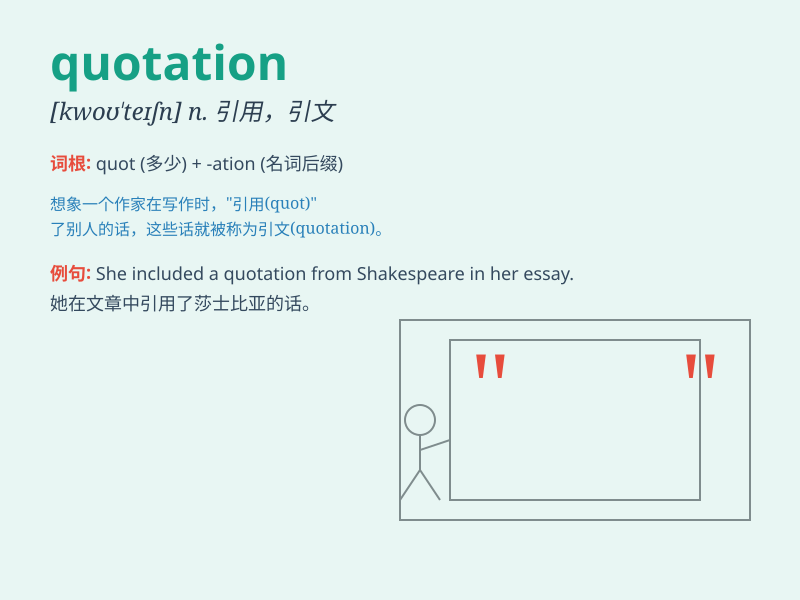

## quotation

**英音:** _[kwə(ʊ)\'teɪʃ(ə)n]_ **美音:** _[kwo\'teʃən]_

**译义:** *n.引用语,价格,报价单,行情表*

### 短语

+ **quotation mark:** _引号_

+ **stock quotation:** _股票行情_

+ **quotation sheet:** _报价单_

+ **quotation price:** _报价_

+ **quotation system:** _报价系统_

### 例句

#### 例句1

> **The quotation for the project was very high.**

**中文翻译:** 这个项目的报价非常高。

**单词释义:** 报价

#### 例句2

> **She always starts her speeches with a famous quotation.**

**中文翻译:** 她总是以一句著名的引语开始她的演讲。

**单词释义:** 引语

#### 例句3

> **Can you give me a quotation for the repair work?**

**中文翻译:** 你能给我维修工作的报价吗？

**单词释义:** 报价

### 背诵小故事

> A writer was constantly looking for inspiration. One day, he found a
magical book full of wonderful quotations. Each quotation was like a key
that unlocked new ideas. With these, his writing became amazing.

**一位作家一直在寻找灵感。有一天，他发现了一本充满精彩语录的神奇书籍。每一条语录都像一把钥匙，开启了新的想法。有了这些，他的写作变得令人惊叹。**

### 图义

