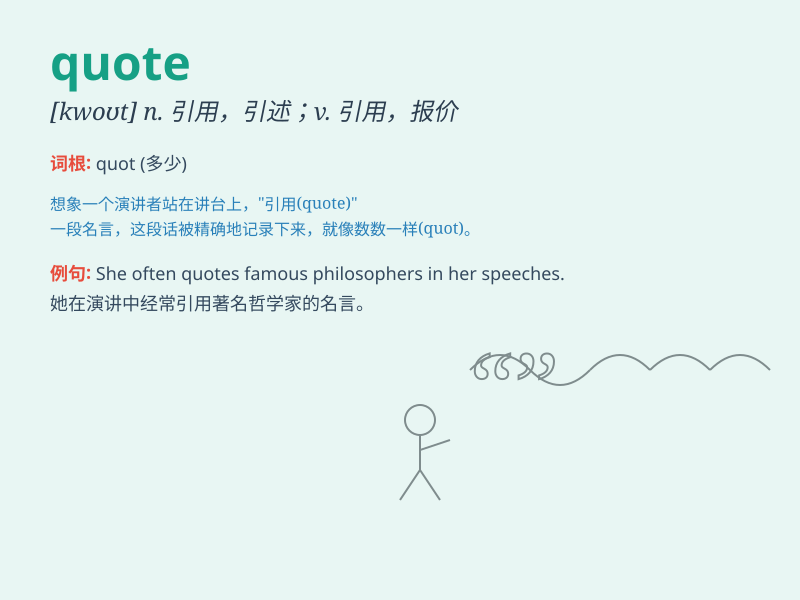

## quote

**英音:** _[kwəʊt]_ **美音:** _[kwot]_

**译义:** *vt.引用,引证,提供,提出,报(价)*

### 短语

+ **quote from:** _引用自_

+ **quote unquote:** _所谓；（用于表示引用他人的话）_

+ **stock quote:** _股票报价_

+ **direct quote:** _直接报价_

+ **quote price:** _报价_

### 例句

#### 例句1

> **She always likes to quote Shakespeare when writing her
essays.**

**中文翻译:** 她写文章时总是喜欢引用莎士比亚的话。

**单词释义:** 引用

#### 例句2

> **The salesman gave me a quote for the new car.**

**中文翻译:** 销售员给了我这辆新车的报价。

**单词释义:** 报价

#### 例句3

> **Can you quote the exact words he said?**

**中文翻译:** 你能引用他说的原话吗？

**单词释义:** 引用

### 背诵小故事

> A writer was always looking for great ideas. One day, he found a
special book full of wonderful words and decided to quote them in his
new story. It made his writing more charming.

**一位作家总是在寻找好点子。有一天，他发现了一本特别的书，里面满是精彩的语句，于是决定在他的新故事里引用它们。这让他的作品更具魅力。**

### 图义

