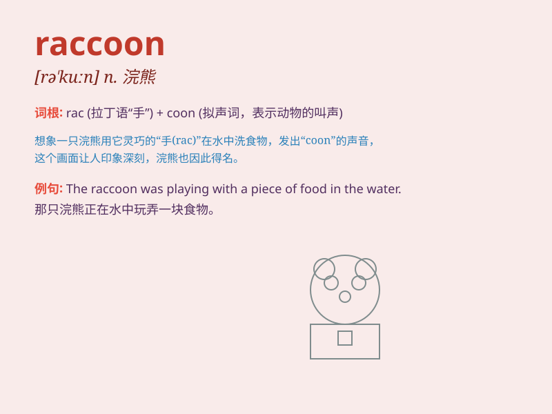

## raccoon

**英音:** _[rə\'kuːn]_ **美音:** _[ræ\'kun]_

**译义:** *n.\<美>[动]浣熊,浣熊毛皮*

### 短语

+ **raccoon dog:** _狸，貉_

+ **raccoon coat:** _浣熊皮大衣_

+ **common raccoon:** _普通浣熊_

+ **raccoon family:** _浣熊家族_

+ **raccoon habitat:** _浣熊栖息地_

### 例句

#### 例句1

> **The raccoon climbed up the tree to search for food.**

**中文翻译:** 这只浣熊爬上树去寻找食物。

**单词释义:** 浣熊

#### 例句2

> **We saw a raccoon rummaging through the garbage cans.**

**中文翻译:** 我们看到一只浣熊在翻垃圾桶。

**单词释义:** 浣熊

#### 例句3

> **The raccoon\'s mask-like face makes it look quite
distinctive.**

**中文翻译:** 浣熊那像面具一样的脸使它看起来相当独特。

**单词释义:** 浣熊

### 背诵小故事

> One night, a little boy was walking in the forest and saw a strange
animal. It had a mask-like face and a ringed tail. The boy asked his
father and learned it was a raccoon. The raccoon was stealing food from
a picnic basket.

**一天晚上，一个小男孩在森林里散步，看到了一只奇怪的动物。它有一张像面具一样的脸和一条带环纹的尾巴。男孩问他的父亲，得知这是一只浣熊。这只浣熊正在从野餐篮里偷食物。**

### 图义

