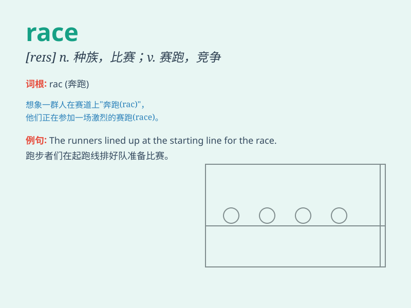

## race

**英音:** _[reɪs]_ **美音:** _[res]_

**译义:**
*n.种族,种族气质,种族特征,赛跑,急流,姜根vi.赛跑,疾走vt.与\...赛跑,使空转*

### 短语

+ **race against time:** _和时间赛跑；抢时间_

+ **car race:** _汽车比赛_

+ **horse race:** _赛马_

+ **race track:** _赛道；赛马跑道_

+ **ethnic race:** _人种；种族_

### 例句

#### 例句1

> **The race was very exciting.**

**中文翻译:** 这场比赛非常激动人心。

**单词释义:** 比赛；竞赛

#### 例句2

> **She is of mixed race.**

**中文翻译:** 她是混血儿。

**单词释义:** 种族

#### 例句3

> **He raced to catch the bus.**

**中文翻译:** 他跑着去赶公交车。

**单词释义:** 快速移动；疾走

### 背诵小故事

> A group of animals were having a race. The rabbit ran very fast, but
the turtle didn\'t give up. Finally, the rabbit was too proud and took a
nap. The turtle won the race.

**一群动物正在进行一场比赛。兔子跑得非常快，但乌龟没有放弃。最后，兔子太骄傲睡了一觉。乌龟赢得了比赛。**

### 图义

