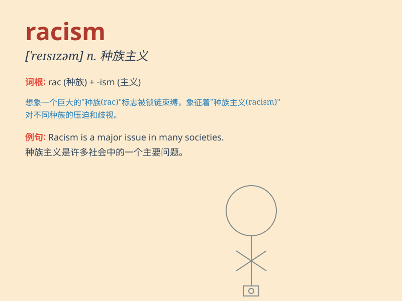

## racism

**英音:** _[\'reɪsɪz(ə)m]_ **美音:** _[\'resɪzəm]_

**译义:** *n.种族主义,人种偏见,种族歧视*

### 短语

+ **institutional racism:** _制度性种族主义_

+ **racial discrimination and racism:** _种族歧视和种族主义_

+ **overcome racism:** _克服种族主义_

+ **racism awareness:** _种族主义意识_

+ **combat racism:** _打击种族主义_

### 例句

#### 例句1

> **Racism is a deeply rooted problem in society.**

**中文翻译:** 种族主义是社会中一个根深蒂固的问题。

**单词释义:** 种族主义

#### 例句2

> **We must fight against all forms of racism.**

**中文翻译:** 我们必须与各种形式的种族主义作斗争。

**单词释义:** 种族主义

#### 例句3

> **His speech exposed the ugly face of racism.**

**中文翻译:** 他的演讲揭露了种族主义的丑恶嘴脸。

**单词释义:** 种族主义

### 背诵小故事

> Once upon a time, in a small town, a person was treated unfairly just
because of their skin color. This unjust behavior is called racism.
It\'s so wrong and unfair to judge people based on race.

**从前，在一个小镇上，有个人仅仅因为肤色就受到不公平对待。这种不公正的行为就叫做种族主义。基于种族来评判人是非常错误和不公平的。**

### 图义

