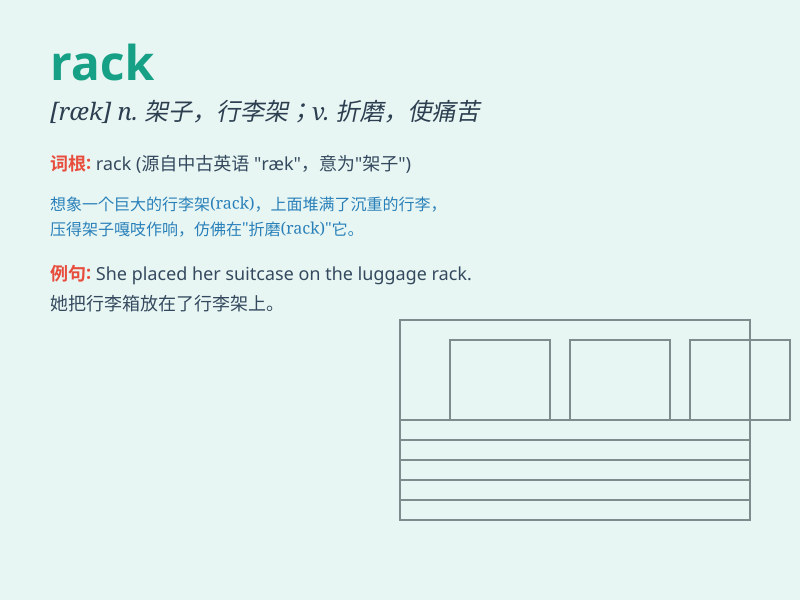

## rack

**英音:** _[ræk]_ **美音:** _[ræk]_

**译义:**
*n.架,行李架,拷问台,小步跑,烧酒,破坏vt.放在架上,在架上制作,折磨,加以拷问,使痛苦,榨取vi.在饲草架装满干草,变形,(云)随风飘,(马)小步跑*

### 短语

+ **rack one\'s brain:** _绞尽脑汁；苦思冥想_

+ **clothes rack:** _衣架_

+ **luggage rack:** _行李架_

+ **rack up:** _积累；得分；获胜_

+ **roof rack:** _车顶行李架_

### 例句

#### 例句1

> **The books were placed on the rack.**

**中文翻译:** 书被放在架子上。

**单词释义:** 架子

#### 例句2

> **He racked his brain trying to solve the math problem.**

**中文翻译:** 他绞尽脑汁试图解决这道数学题。

**单词释义:** 绞尽（脑汁）

#### 例句3

> **The car was damaged when it hit the parking rack.**

**中文翻译:** 汽车撞到停车架时受损了。

**单词释义:** 架子

### 背诵小故事

> A thief was trying to steal jewels from a store. He climbed up a rack
to reach the top shelf. But the rack broke and he fell down with a loud
noise. The police came and caught him.

**一个小偷试图从一家商店偷珠宝。他爬上一个架子去够顶层的架子。但是架子断了，他伴随着一声巨响摔了下来。警察来了并抓住了他。**

### 图义

