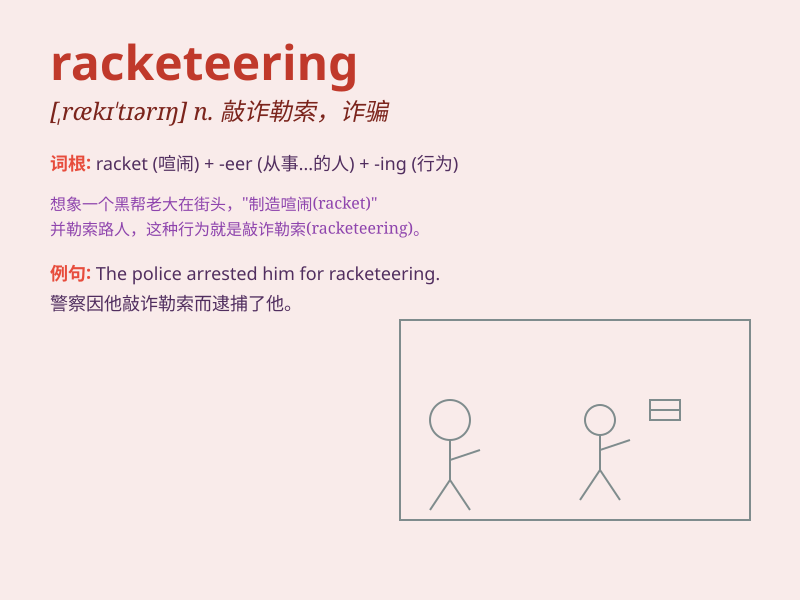

## racketeering

**英音:** _[ˌrækəˈtɪərɪŋ]_ **美音:** _[ˌrækəˈtɪrɪŋ]_

**译义:** *n.敲诈勒索,诈骗*

### 短语

+ **organized racketeering:** _有组织的敲诈勒索活动_

+ **racketeering enterprise:** _敲诈勒索企业_

+ **racketeering activity:** _敲诈勒索活动_

+ **criminal racketeering:** _刑事敲诈勒索_

+ **racketeering conspiracy:** _敲诈勒索共谋_

### 例句

#### 例句1

> **The police are cracking down on racketeering in the local
business district.**

**中文翻译:** 警方正在打击当地商业区的敲诈勒索行为。

**单词释义:** 敲诈勒索行为

#### 例句2

> **He was accused of involvement in racketeering activities.**

**中文翻译:** 他被指控参与敲诈勒索活动。

**单词释义:** 敲诈勒索活动

#### 例句3

> **The new law aims to prevent racketeering and protect
consumers.**

**中文翻译:** 新法律旨在防止敲诈勒索并保护消费者。

**单词释义:** 敲诈勒索

### 背诵小故事

> A gangster was involved in racketeering. He forced local businesses
to pay him protection money or face trouble. But the police were
determined to stop his illegal activities and finally caught him.

**一个歹徒参与了敲诈勒索活动。他强迫当地企业给他交保护费，否则就找麻烦。但警方决心制止他的非法活动，最终抓住了他。**

### 图义

