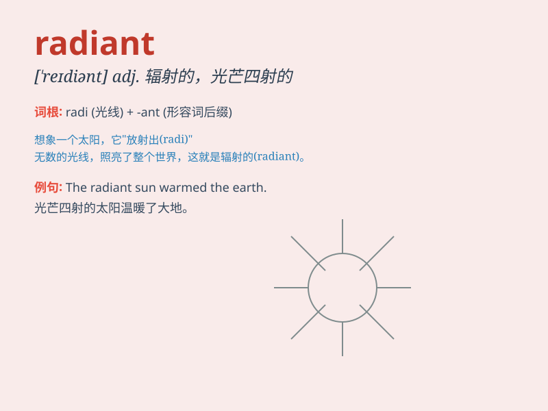

## radiant

**英音:** _[\'reɪdɪənt]_ **美音:** _[\'redɪənt]_

**译义:** *adj.发光的,辐射的,容光焕发的*

### 短语

+ **radiant energy:** _辐射能_

+ **radiant heat:** _辐射热_

+ **radiant smile:** _灿烂的笑容_

+ **radiant future:** _光明的未来_

+ **radiant complexion:** _容光焕发的面色_

### 例句

#### 例句1

> **The bride looked radiant on her wedding day.**

**中文翻译:** 新娘在她的婚礼当天看起来容光焕发。

**单词释义:** 容光焕发的；光彩照人的

#### 例句2

> **The sun was radiant, warming the earth below.**

**中文翻译:** 太阳光芒四射，温暖着下面的大地。

**单词释义:** 光芒四射的；辐射的

#### 例句3

> **She had a radiant smile that could light up a room.**

**中文翻译:** 她有一个灿烂的笑容，可以照亮一个房间。

**单词释义:** 灿烂的；喜悦的

### 背诵小故事

> A princess was lost in a dark forest. Suddenly, she saw a radiant
light. It was from a magical gem that guided her way home. The light was
so bright and warm, just like the meaning of \'radiant\'.

**一位公主在黑暗的森林中迷路了。突然，她看到了一道光芒四射的光。它来自一颗神奇的宝石，为她指引了回家的路。这光如此明亮和温暖，就像\'radiant\'这个词的意思。**

### 图义

