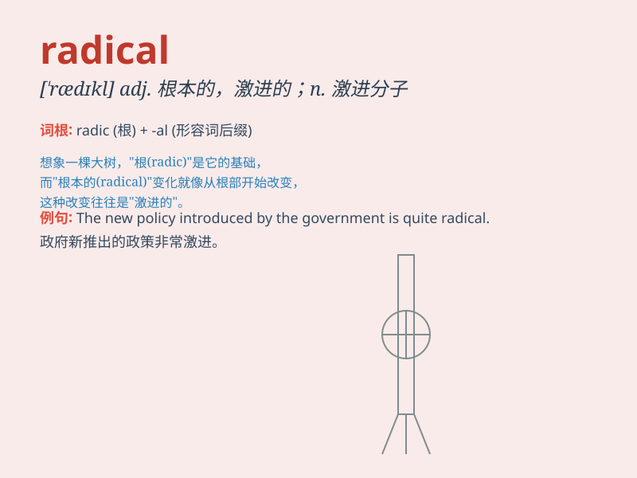

## radical

**英音:** _[\'rædɪk(ə)l]_ **美音:** _[\'rædɪkl]_

**译义:** *adj.根本的,基本的,激进的n.激进分子*

### 短语

+ **radical change:** _根本的变化；彻底的改变_

+ **radical reform:** _彻底的改革_

+ **radical treatment:** _根治性治疗_

+ **radical idea:** _激进的想法_

+ **radical innovation:** _根本性创新_

### 例句

#### 例句1

> **The new policy is a radical departure from the old one.**

**中文翻译:** 这项新政策与旧政策截然不同。

**单词释义:** 根本的；彻底的

#### 例句2

> **He holds radical views on politics.**

**中文翻译:** 他在政治上持有激进的观点。

**单词释义:** 激进的

#### 例句3

> **The doctor suggested a radical treatment for her illness.**

**中文翻译:** 医生建议对她的病采取根治性治疗。

**单词释义:** 根治的；彻底的

### 背诵小故事

> A scientist was conducting radical experiments. He was not afraid to
take bold steps and challenge old theories. His radical ideas led to
amazing discoveries.

**一位科学家正在进行激进的实验。他不怕采取大胆的步骤，挑战旧理论。他激进的想法带来了惊人的发现。**

### 图义

