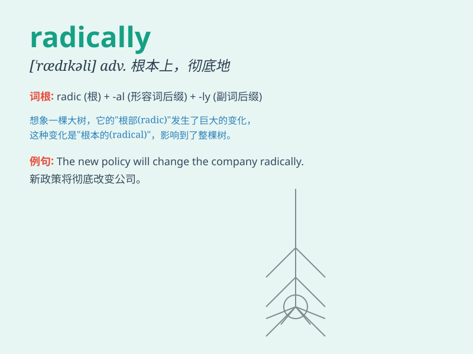

## radically

**英音:** _[\'rædɪkəlɪ]_ **美音:** _[\'rædɪkli]_

**译义:** *adv.根本上,以激进的方式*

### 短语

+ **radically different:** _截然不同_

+ **radically change:** _彻底改变_

+ **radically new:** _全新的_

+ **radically improve:** _极大地改进_

+ **radically reduce:** _大幅减少_

### 例句

#### 例句1

> **The new policy has radically changed the way we do business.**

**中文翻译:** 这项新政策从根本上改变了我们做生意的方式。

**单词释义:** 从根本上

#### 例句2

> **Her thinking has radically shifted since she started
traveling.**

**中文翻译:** 自从她开始旅行，她的想法发生了根本性的转变。

**单词释义:** 根本性地

#### 例句3

> **The technology has radically improved our lives.**

**中文翻译:** 这项技术极大地改善了我们的生活。

**单词释义:** 极大地

### 背诵小故事

> A brave scientist was trying to solve a difficult problem. His ideas
were radically different from others. Everyone thought he was crazy, but
in the end, his radical approach led to a great discovery.

**一位勇敢的科学家试图解决一个难题。他的想法与其他人截然不同。大家都认为他疯了，但最终，他这种激进的方法带来了重大发现。**

### 图义

