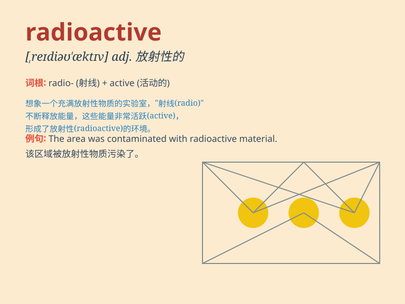

## radioactive

**英音:** _[,reɪdɪəʊ\'æktɪv]_ **美音:**
_[\'redɪo\'æktɪv]_

**译义:** *adj.放射性的,有辐射能的*

### 短语

+ **radioactive waste:** _放射性废物_

+ **radioactive isotope:** _放射性同位素_

+ **radioactive decay:** _放射性衰变_

+ **radioactive material:** _放射性物质_

+ **radioactive contamination:** _放射性污染_

### 例句

#### 例句1

> **The radioactive waste needs to be handled with extreme
caution.**

**中文翻译:** 放射性废物需要极其小心地处理。

**单词释义:** 放射性的

#### 例句2

> **Some areas near the nuclear power plant are contaminated with
radioactive substances.**

**中文翻译:** 核电站附近的一些地区被放射性物质污染了。

**单词释义:** 放射性的

#### 例句3

> **Scientists are studying the effects of radioactive radiation on
living organisms.**

**中文翻译:** 科学家们正在研究放射性辐射对生物的影响。

**单词释义:** 放射性的

### 背诵小故事

> A scientist was working in a lab with a strange substance. When he
tested it, he found it was radioactive. It glowed and gave off dangerous
energy. He had to handle it very carefully.

**一位科学家在实验室里研究一种奇怪的物质。当他测试时，发现它具有放射性。它会发光并释放出危险的能量。他必须非常小心地处理它。**

### 图义

