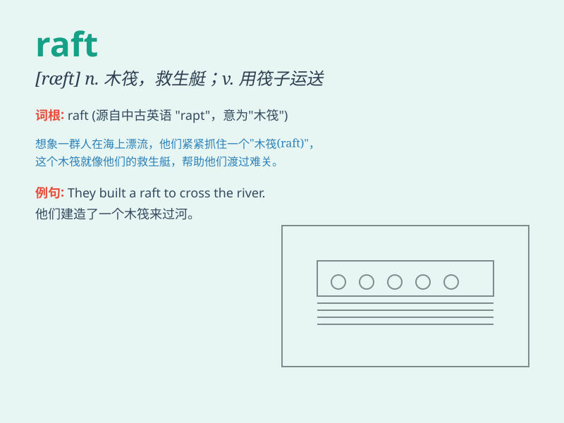

## raft

**英音:** _[rɑːft]_ **美音:** _[ræft]_

**译义:** *n.筏,救生艇,橡皮船,大量vi.乘筏vt.筏运,制成筏*

### 短语

+ **raft race:** _木筏比赛_

+ **raft foundation:** _筏式基础；筏形基础_

+ **life raft:** _救生筏_

+ **bamboo raft:** _竹筏_

+ **raft trip:** _木筏旅行_

### 例句

#### 例句1

> **They built a raft to cross the river.**

**中文翻译:** 他们造了一个木筏来渡河。

**单词释义:** 木筏

#### 例句2

> **The raft drifted along the stream.**

**中文翻译:** 那只木筏沿着溪流漂流。

**单词释义:** 木筏

#### 例句3

> **He tied the logs together to make a raft.**

**中文翻译:** 他把原木捆在一起做成一个木筏。

**单词释义:** 木筏

### 背诵小故事

> A group of friends was lost in the forest. They needed to cross a
river. Luckily, they found a raft and used it to float safely to the
other side. The raft saved them!

**一群朋友在森林里迷路了。他们需要过河。幸运的是，他们找到了一只木筏，并借助它安全地漂到了对岸。这只木筏救了他们！**

### 图义

