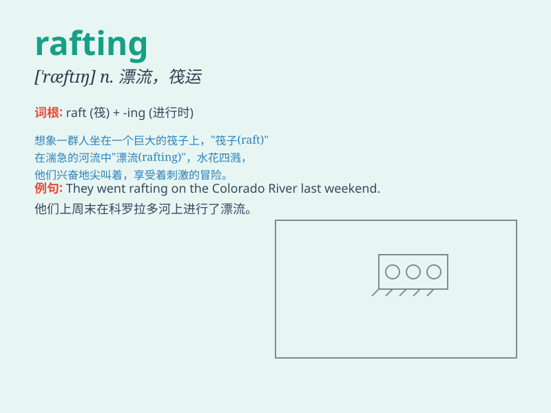

## rafting

**英音:** _[ˈræftɪŋ]_ **美音:** _[ˈræftɪŋ]_

**译义:** *n. 筏运，漂流；筏运业 vi. 乘筏漂流（raft的现在分词）*

### 短语

+ **white water rafting:** _白水漂流_

+ **rafting adventure:** _漂流冒险_

+ **river rafting:** _河流漂流_

+ **rafting trip:** _漂流之旅_

+ **rafting experience:** _漂流体验_

### 例句

#### 例句1

> **We went rafting on the wild river last weekend.**

**中文翻译:** 上周末我们在那条湍急的河流上进行了漂流。

**单词释义:** 漂流

#### 例句2

> **Rafting is a thrilling adventure activity.**

**中文翻译:** 漂流是一项令人兴奋的冒险活动。

**单词释义:** 漂流

#### 例句3

> **They are planning a rafting trip during the summer vacation.**

**中文翻译:** 他们正在计划暑假期间的一次漂流之旅。

**单词释义:** 漂流

### 背诵小故事

> One day, Tom and his friends decided to go rafting. They got on the
rafts and floated along the river, enjoying the beautiful scenery. It
was an exciting adventure. They shouted and laughed all the way.

**有一天，汤姆和他的朋友们决定去漂流。他们坐上了筏子，沿着河流漂流，欣赏着美丽的风景。这是一场刺激的冒险。他们一路上又喊又笑。**

### 图义

