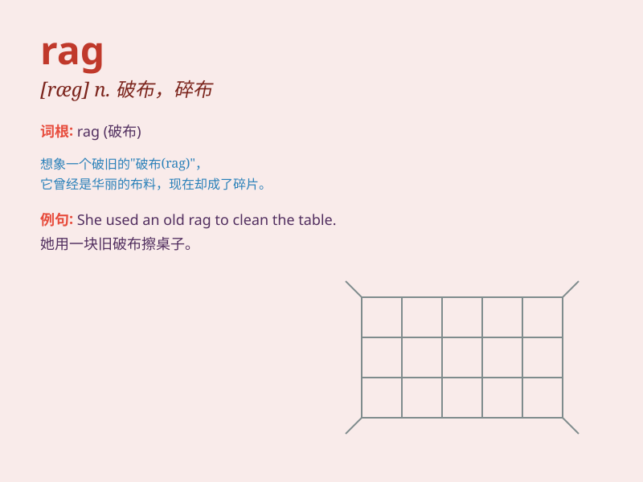

## rag

**英音:** _[ræg]_ **美音:** _[ræɡ]_

**译义:**
*n.抹布,碎屑,石板瓦,破旧衣服,少量vt.揶揄,戏弄,欺负vi.喧闹*

### 短语

+ **in rags:** _衣衫褴褛；穿着破旧_

+ **rag doll:** _布娃娃；碎布制玩偶_

+ **rag trade:** _服装业；服装生意_

+ **chew the rag:** _闲聊；聊天_

+ **rag week:** _（大学的）慈善募捐周_

### 例句

#### 例句1

> **He wiped his face with a dirty rag.**

**中文翻译:** 他用一块脏抹布擦脸。

**单词释义:** 抹布；破布

#### 例句2

> **The car was in a rag state after the accident.**

**中文翻译:** 事故后这辆车破烂不堪。

**单词释义:** 破烂的衣服；破旧的东西

#### 例句3

> **Don\'t rag on him all the time.**

**中文翻译:** 别老是对他唠叨。

**单词释义:** 嘲笑；捉弄；对...开玩笑

### 背诵小故事

> One day, a poor man was walking on the street. Suddenly, a strong
wind blew away his hat. He ran after it but could only catch a dirty
rag. He felt so sad as the rag was of no use to him.

**一天，一个穷人走在街上。突然，一阵强风把他的帽子吹走了。他追过去，但只抓到了一块脏抹布。他感到很难过，因为这块抹布对他毫无用处。**

### 图义

