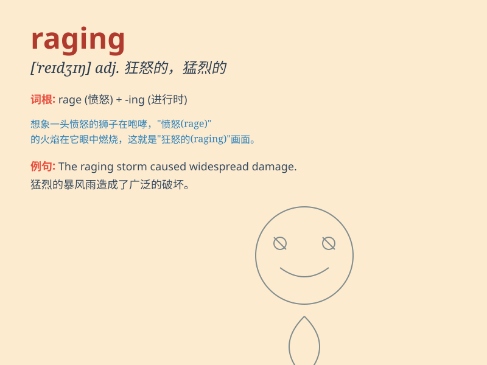

## raging

**英音:** _[\'reɪdʒɪŋ]_ **美音:** _[\'redʒɪŋ]_

**译义:** *adj.狂怒的*

### 短语

+ **raging fire:** _熊熊大火_

+ **raging storm:** _狂风暴雨_

+ **raging river:** _汹涌的河流_

+ **raging bull:** _狂怒的公牛_

+ **raging fever:** _高烧_

### 例句

#### 例句1

> **The raging storm caused a lot of damage.**

**中文翻译:** 这场狂暴的风暴造成了很多破坏。

**单词释义:** 狂暴的；猛烈的

#### 例句2

> **He has a raging temper.**

**中文翻译:** 他脾气暴躁。

**单词释义:** 暴躁的；愤怒的

#### 例句3

> **The raging fire spread quickly through the forest.**

**中文翻译:** 熊熊大火在森林里迅速蔓延。

**单词释义:** 熊熊的；凶猛的

### 背诵小故事

> A fierce lion was running in the forest, its eyes glowing and its
roar was deafening. The lion was in a raging state, showing its wild and
uncontrollable power. People were scared when they heard about this
raging lion.

**一只凶猛的狮子在森林里奔跑，它的眼睛闪闪发光，吼声震耳欲聋。这只狮子处于狂怒的状态，展现出它狂野且无法控制的力量。人们听到这只狂怒的狮子时都感到害怕。**

### 图义

