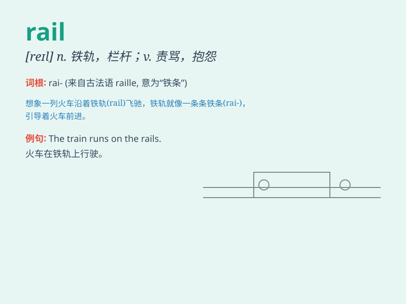

## rail

**英音:** _[reɪl]_ **美音:** _[rel]_

**译义:** *n.横杆,围栏,扶手,铁轨vt.以横木围栏,铺铁轨vi.责骂,抱怨*

### 短语

+ **railroad crossing:** _铁路道口_

+ **rail transport:** _铁路运输_

+ **rail fence:** _木栅栏_

+ **on the rails:** _正常进行；在正常轨道上_

+ **rail against:** _猛烈抨击；责骂_

### 例句

#### 例句1

> **The train runs along the rail.**

**中文翻译:** 火车沿着铁轨行驶。

**单词释义:** 铁轨

#### 例句2

> **She leaned against the rail and watched the sea.**

**中文翻译:** 她倚着栏杆看海。

**单词释义:** 栏杆

#### 例句3

> **The workers are repairing the rail.**

**中文翻译:** 工人们正在修理铁轨。

**单词释义:** 铁轨

### 背诵小故事

> A little mouse was running along the rail of a railway track.
Suddenly, a train came. The mouse was so scared but luckily it jumped
off in time. The rail was long and straight, guiding the train.

**一只小老鼠正沿着铁路轨道的栏杆跑。突然，一列火车来了。老鼠很害怕，但幸运的是它及时跳了下来。栏杆又长又直，引导着火车。**

### 图义

