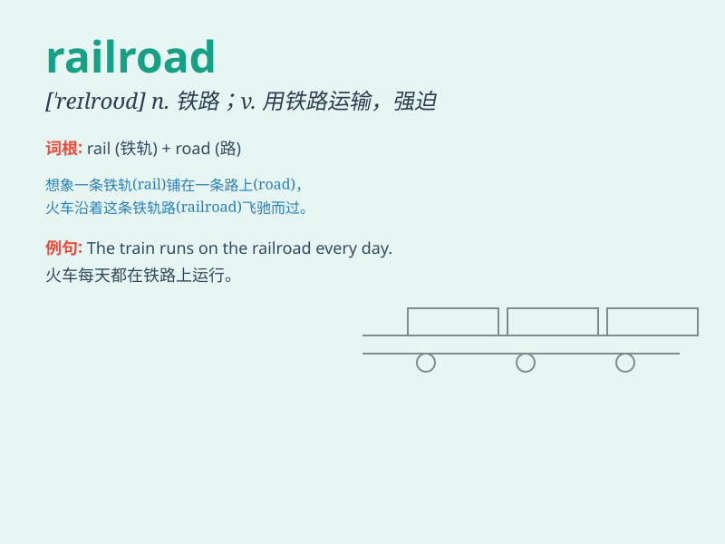

## railroad

**英音:** _[\'reɪlrəʊd]_ **美音:** _[\'relrod]_

**译义:** *n.铁路vt.\<美> 由铁道运输*

### 短语

+ **railroad crossing:** _铁路道口_

+ **railroad station:** _火车站_

+ **railroad track:** _铁轨_

+ **railroad engineer:** _铁路工程师_

+ **railroad bridge:** _铁路桥_

### 例句

#### 例句1

> **The railroad tracks run parallel to the highway.**

**中文翻译:** 铁路轨道与高速公路平行。

**单词释义:** 铁路

#### 例句2

> **They are building a new railroad to connect the two cities.**

**中文翻译:** 他们正在修建一条新的铁路来连接这两个城市。

**单词释义:** 铁路

#### 例句3

> **The goods were transported by railroad.**

**中文翻译:** 货物是通过铁路运输的。

**单词释义:** 铁路

### 背诵小故事

> A brave detective was chasing a criminal. The criminal tried to
escape by running along the railroad. But the detective was smart and
caught him. The railroad became the key to solving the case.

**一位勇敢的侦探正在追捕一名罪犯。罪犯试图沿着铁路逃跑。但侦探很聪明，抓住了他。铁路成为了破案的关键。**

### 图义

