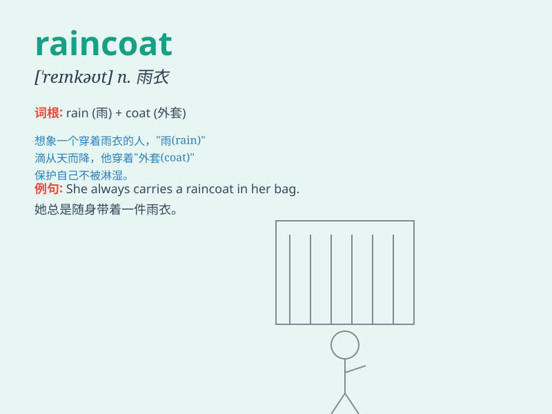

## raincoat

**英音:** _[\'reɪnkəʊt]_ **美音:** _[ˈreɪnkoʊt]_

**译义:** *n.\<美>雨衣*

### 短语

+ **put on a raincoat:** _穿上雨衣_

+ **wear a raincoat:** _穿着雨衣_

+ **take off a raincoat:** _脱下雨衣_

+ **fold a raincoat:** _叠雨衣_

+ **hang up a raincoat:** _挂起雨衣_

### 例句

#### 例句1

> **I need to buy a new raincoat because mine is torn.**

**中文翻译:** 我需要买一件新的雨衣，因为我的那件破了。

**单词释义:** 雨衣

#### 例句2

> **She put on her raincoat and went for a walk in the rain.**

**中文翻译:** 她穿上雨衣在雨中散步。

**单词释义:** 雨衣

#### 例句3

> **The raincoat kept him dry during the heavy storm.**

**中文翻译:** 在这场大暴雨中，雨衣使他保持干爽。

**单词释义:** 雨衣

### 背诵小故事

> One rainy day, Tom forgot his raincoat at home. He got completely wet
on his way back. Since then, whenever it rains, he always remembers to
take his trusty raincoat.

**在一个下雨天，汤姆把他的雨衣忘在家里了。在回家的路上他浑身湿透。从那以后，每当下雨，他总是记得带上他那可靠的雨衣。**

### 图义

