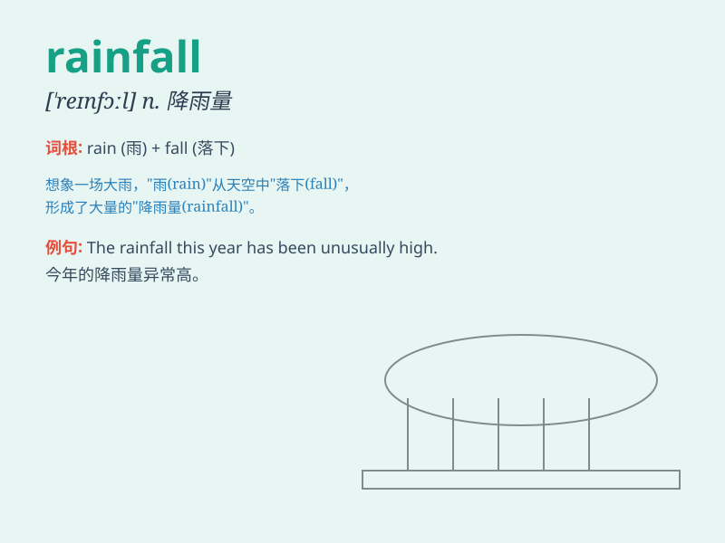

## rainfall

**英音:** _[\'reɪnfɔːl]_ **美音:** _[\'ren\'fɔl]_

**译义:** *n.降雨,降雨量*

### 短语

+ **average rainfall:** _平均降雨量_

+ **heavy rainfall:** _暴雨；大量降雨_

+ **light rainfall:** _小雨；少量降雨_

+ **rainfall amount:** _降雨量_

+ **rainfall distribution:** _降雨分布_

### 例句

#### 例句1

> **The average annual rainfall in this region is about 800
millimeters.**

**中文翻译:** 这个地区的年平均降雨量约为 800 毫米。

**单词释义:** 降雨量

#### 例句2

> **Heavy rainfall caused flooding in many parts of the city.**

**中文翻译:** 强降雨导致城市的许多地方发生了洪水。

**单词释义:** 降雨

#### 例句3

> **This year\'s rainfall has been significantly lower than
usual.**

**中文翻译:** 今年的降雨量明显低于往常。

**单词释义:** 降雨量

### 背诵小故事

> One day, a little boy was very worried. Because there was too much
rainfall and his favorite football game was canceled. But then he found
fun playing in the puddles. The heavy rainfall became an unexpected
adventure for him.

**有一天，一个小男孩非常担心。因为降雨量太大，他最喜欢的足球比赛取消了。但后来他在水坑里玩耍找到了乐趣。这场大雨对他来说变成了一次意外的冒险。**

### 图义

