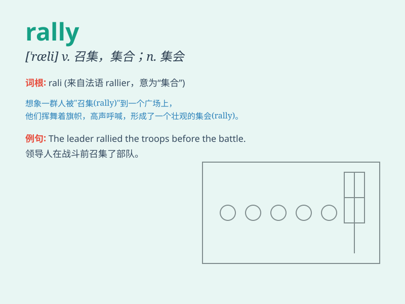

## rally

**英音:** _[\'rælɪ]_ **美音:** _[\'ræli]_

**译义:**
*v.重整旗鼓,给予新力量,(使)恢复健康,力量,决心,集结n.集会*

### 短语

+ **rally point:** _集合点_

+ **rally round:** _团结在\...\...周围_

+ **rally support:** _争取支持_

+ **political rally:** _政治集会_

+ **rally the troops:** _召集军队_

### 例句

#### 例句1

> **The team managed to rally in the second half and win the
game.**

**中文翻译:** 这个队在下半场成功振作起来并赢得了比赛。

**单词释义:** 振作；恢复

#### 例句2

> **Supporters rallied outside the courthouse to show their
support.**

**中文翻译:** 支持者们在法院外集会以表示他们的支持。

**单词释义:** 集合；召集

#### 例句3

> **The stock market began to rally after a period of decline.**

**中文翻译:** 股市在一段下跌之后开始回升。

**单词释义:** 回升；反弹

### 背诵小故事

> A group of friends were lost in the forest. But they rallied
together, sharing food and finding the way out. \'Rally\' means to come
together and unite for a common purpose, just like these friends did.

**一群朋友在森林里迷路了。但他们团结起来，分享食物并找到了出路。\'rally\'意思是为了一个共同的目的聚集并团结起来，就像这些朋友所做的那样。**

### 图义

