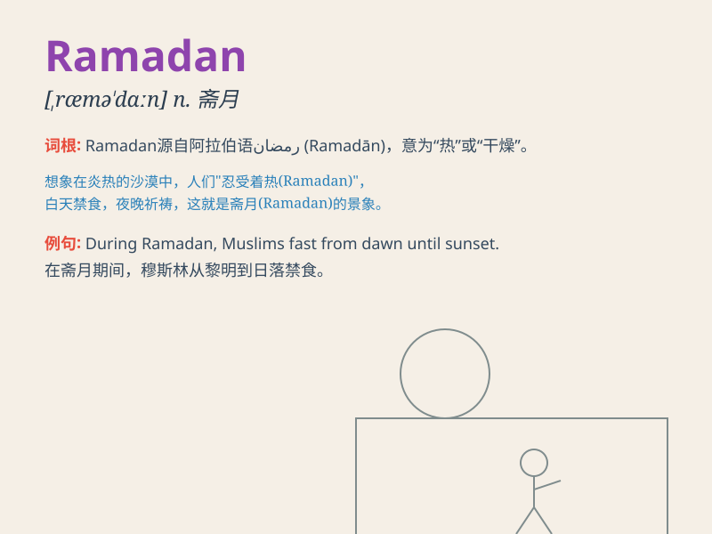

## Ramadan

**英音:** _[rəˈmɑːdɑn]_ **美音:** _[rəˈmædən]_

**译义:** *伊斯兰教的第九个月，斋月，穆斯林在该月从黎明到日落禁食*

### 短语

+ **Ramadan fast:** _斋月禁食_

+ **Ramadan month:** _斋月_

+ **Ramadan observance:** _斋月遵守_

+ **Ramadan celebration:** _斋月庆祝_

+ **Ramadan prayer:** _斋月祈祷_

### 例句

#### 例句1

> **During Ramadan, many Muslims fast from dawn to dusk.**

**中文翻译:** 在斋月期间，许多穆斯林从黎明到黄昏禁食。

**单词释义:** 斋月

#### 例句2

> **She always prays more frequently in Ramadan.**

**中文翻译:** 她在斋月总是更频繁地祈祷。

**单词释义:** 斋月

#### 例句3

> **Ramadan is a time of spiritual reflection for believers.**

**中文翻译:** 斋月对于信徒来说是一个进行精神反思的时间。

**单词释义:** 斋月

### 背诵小故事

> During Ramadan, a young boy named Ahmed was determined to follow the
strict fasting rules. He resisted temptation and grew stronger in his
faith. At the end of Ramadan, he felt a deep sense of accomplishment and
spiritual growth.

**在斋月期间，一个叫艾哈迈德的小男孩决心遵守严格的斋戒规定。他抵制住了诱惑，信仰变得更加坚定。在斋月结束时，他感到一种深深的成就感和精神上的成长。**

### 图义

