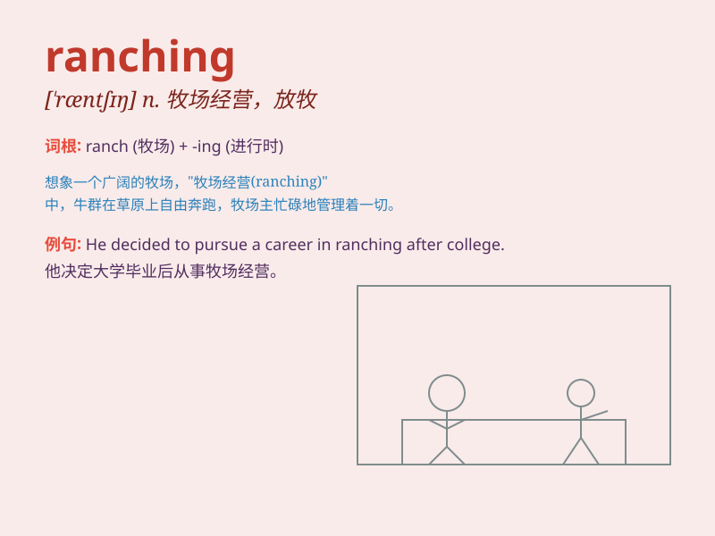

## ranching

**英音:** _[ræntʃɪŋ]_ **美音:** _[ræntʃɪŋ]_

**译义:** *n. 牧场经营，放牧；v. 经营牧场（ranch的现在分词）*

### 短语

+ **cattle ranching:** _养牛业_

+ **horse ranching:** _养马业_

+ **ranching activities:** _牧场经营活动_

+ **ranching business:** _牧场生意_

+ **ranching economy:** _牧场经济_

### 例句

#### 例句1

> **He decided to pursue ranching after graduating from college.**

**中文翻译:** 他大学毕业后决定从事牧场经营。

**单词释义:** 牧场经营

#### 例句2

> **Ranching is a tough but rewarding occupation.**

**中文翻译:** 牧场经营是一项艰难但有回报的职业。

**单词释义:** 牧场经营

#### 例句3

> **The area is known for its prosperous ranching industry.**

**中文翻译:** 这个地区以其繁荣的牧场业而闻名。

**单词释义:** 牧场业

### 背诵小故事

> One day, Tom decided to leave the city and try ranching. He bought a
large piece of land and raised many cows and horses. He worked hard
every day and finally became a successful rancher.

**有一天，汤姆决定离开城市尝试经营牧场。他买了一大片土地，养了很多牛和马。他每天努力工作，最终成为了一名成功的牧场主。**

### 图义

