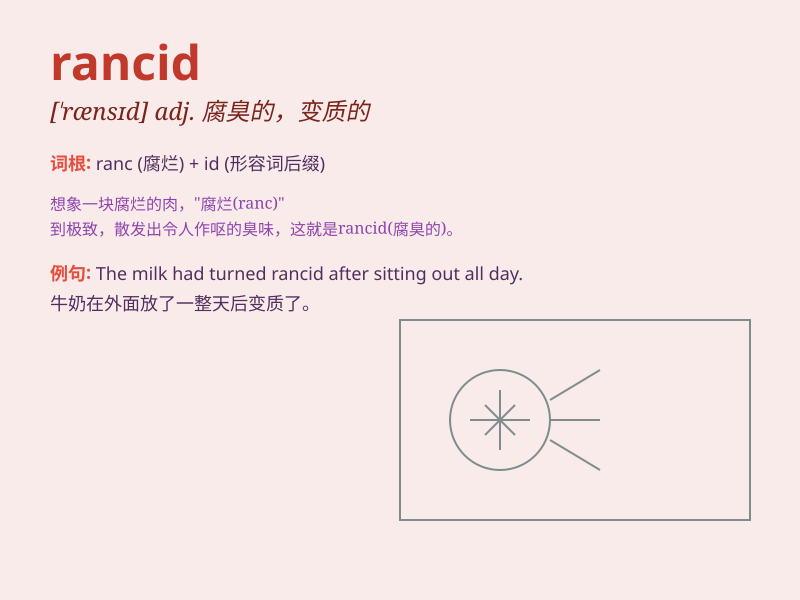

## rancid

**英音:** _[\'rænsɪd]_ **美音:** _[\'rænsɪd]_

**译义:** *adj.象油脂腐臭味的,腐臭的*

### 短语

+ **rancid butter:** _腐臭的黄油_

+ **rancid smell:** _腐臭的气味_

+ **rancid oil:** _变质的油_

+ **rancid meat:** _腐坏的肉_

+ **rancid fish:** _发臭的鱼_

### 例句

#### 例句1

> **The butter had gone rancid and smelled terrible.**

**中文翻译:** 这块黄油已经变质了，闻起来很糟糕。

**单词释义:** 变质的；腐臭的

#### 例句2

> **The smell of rancid oil filled the kitchen.**

**中文翻译:** 变质油的气味充满了厨房。

**单词释义:** 腐臭的；有哈喇味的

#### 例句3

> **He threw away the rancid meat immediately.**

**中文翻译:** 他立刻扔掉了变质的肉。

**单词释义:** 变质的；发臭的

### 背诵小故事

> One day, Tom opened an old box in the attic and smelled a terrible
odor. He found some rancid butter that had gone bad a long time ago. The
smell was so strong that it made him feel sick. Now he\'ll never forget
the word \'rancid\'.

**一天，汤姆在阁楼打开一个旧箱子，闻到一股难闻的气味。他发现了一些很久以前就变质了的腐臭的黄油。那味道太强烈，让他感到恶心。现在他永远不会忘记\'rancid\'这个词了。**

### 图义

