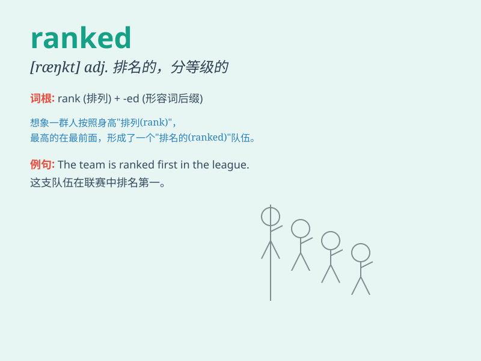

## ranked

**英音:** _[ræŋkt]_ **美音:** _[ræŋkt]_

**译义:** *adj. 排序的；分等级的；有排名的*

### 短语

+ **ranked first:** _排名第一_

+ **ranked high:** _排名高_

+ **ranked among:** _位列其中_

+ **be ranked as:** _被列为_

+ **ranked list:** _排名列表_

### 例句

#### 例句1

> **He ranked first in the exam.**

**中文翻译:** 他在考试中排名第一。

**单词释义:** 排名为

#### 例句2

> **The hotel is ranked among the best in the city.**

**中文翻译:** 这家酒店被列为这座城市最好的酒店之一。

**单词释义:** 被列为

#### 例句3

> **She ranked high on the list of successful entrepreneurs.**

**中文翻译:** 她在成功企业家的名单上排名很高。

**单词释义:** 排名

### 背诵小故事

> In a fierce competition, players were ranked based on their
performance. Tom worked hard and finally ranked first. His success
showed that effort pays off.

**在一场激烈的竞赛中，选手们根据表现被排名。汤姆努力拼搏，最终排名第一。他的成功表明努力会有回报。**

### 图义

