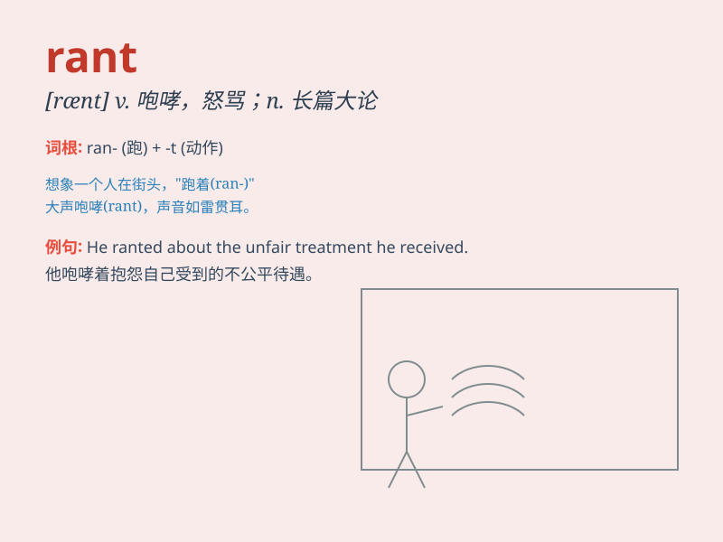

## rant

**英音:** _[rænt]_ **美音:** _[rænt]_

**译义:** *v.咆哮,激昂地说n.咆哮,激昂的演说*

### 短语

+ **rant and rave:** _大声叫嚷；愤怒地抱怨_

+ **rant about:** _对\...\...大声抱怨_

+ **rant on:** _不停地抱怨_

+ **rant off:** _突然开始滔滔不绝地抱怨_

+ **rant against:** _强烈谴责；激烈抨击_

### 例句

#### 例句1

> **He ranted about the poor service at the restaurant.**

**中文翻译:** 他怒气冲冲地抱怨餐厅的服务差。

**单词释义:** 愤怒地叫嚷；大声抱怨

#### 例句2

> **The politician ranted on the stage for hours.**

**中文翻译:** 这位政客在台上咆哮了几个小时。

**单词释义:** 夸夸其谈；大声叫嚷

#### 例句3

> **She ranted against the injustice of the system.**

**中文翻译:** 她猛烈抨击这个体制的不公。

**单词释义:** 激烈地指责；痛斥

### 背诵小故事

>
有一天，老板在办公室里RANT，大声抱怨员工的工作表现。员工们都很紧张，因为老板RANT的声音特别大，就像狂风暴雨一样。后来大家才明白，老板是因为压力太大才这样。

**有一天，老板在办公室大声抱怨，员工们很紧张，后来才知老板因压力大才这样。**

### 图义

