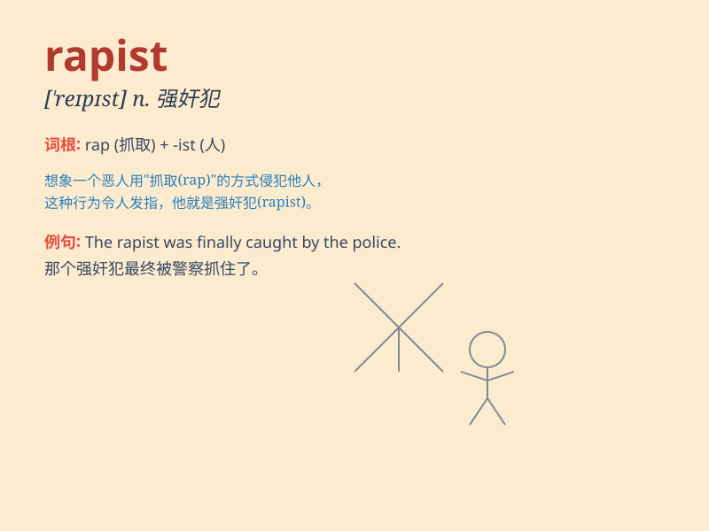

## rapist

**英音:** _[\'reɪpɪst]_ **美音:** _[\'repɪst]_

**译义:** *n.强奸者,强奸犯*

### 短语

+ **serial rapist:** _连环强奸犯_

+ **convicted rapist:** _已定罪的强奸犯_

+ **potential rapist:** _潜在的强奸犯_

+ **violent rapist:** _暴力强奸犯_

+ **known rapist:** _已知的强奸犯_

### 例句

#### 例句1

> **The rapist was finally caught by the police.**

**中文翻译:** 那个强奸犯最终被警方抓获。

**单词释义:** 强奸犯

#### 例句2

> **She was attacked by a rapist on her way home.**

**中文翻译:** 她在回家的路上遭到了一个强奸犯的袭击。

**单词释义:** 强奸犯

#### 例句3

> **The community was in shock after learning about the presence of a
rapist.**

**中文翻译:** 得知有强奸犯的存在后，这个社区都震惊了。

**单词释义:** 强奸犯

### 背诵小故事

> A girl was walking alone at night. Suddenly, a bad man appeared and
attacked her. This evil man was a rapist. The police came quickly and
caught him. Remember, a rapist is someone who commits this horrible
crime.

**一个女孩在晚上独自走路。突然，一个坏人出现并攻击了她。这个邪恶的人就是强奸犯。警察很快赶来并抓住了他。记住，rapist
就是犯下这种可怕罪行的人。**

### 图义

