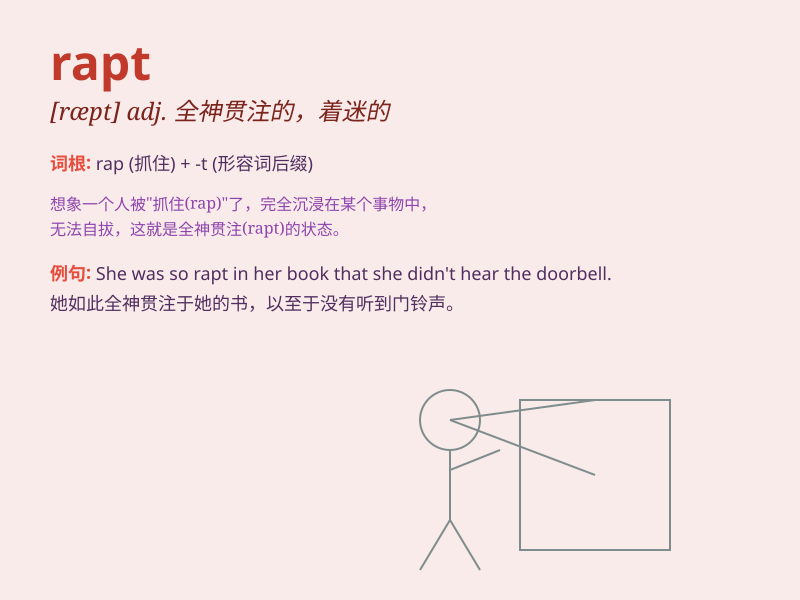

## rapt

**英音:** _[ræpt]_ **美音:** _[ræpt]_

**译义:** *adj.全神贯注的*

### 短语

+ **be rapt in:** _全神贯注于；沉浸于_

+ **rapt attention:** _全神贯注；聚精会神_

+ **rapt look:** _着迷的神情；入神的样子_

+ **rapt silence:** _全神贯注的沉默；入迷的安静_

+ **rapt devotion:** _全身心的投入；虔诚的奉献_

### 例句

#### 例句1

> **She was rapt in thought, oblivious to her surroundings.**

**中文翻译:** 她陷入沉思，忘却了周围的一切。

**单词释义:** 全神贯注的；入迷的

#### 例句2

> **The audience was rapt as the musician played the beautiful
melody.**

**中文翻译:** 当音乐家演奏这首优美的旋律时，观众听得入迷。

**单词释义:** 被深深吸引的；着迷的

#### 例句3

> **He listened to the story with rapt attention.**

**中文翻译:** 他全神贯注地听着这个故事。

**单词释义:** 专心致志的；全神贯注的

### 背诵小故事

> A girl was so rapt when reading a fairy tale. She was completely
immersed in the magical world, not hearing anything around. \'Rapt\'
means being completely engrossed or absorbed.

**一个女孩读童话故事时非常入迷。她完全沉浸在神奇的世界里，什么都听不见。\'rapt\'意思是全神贯注的、入迷的。**

### 图义

