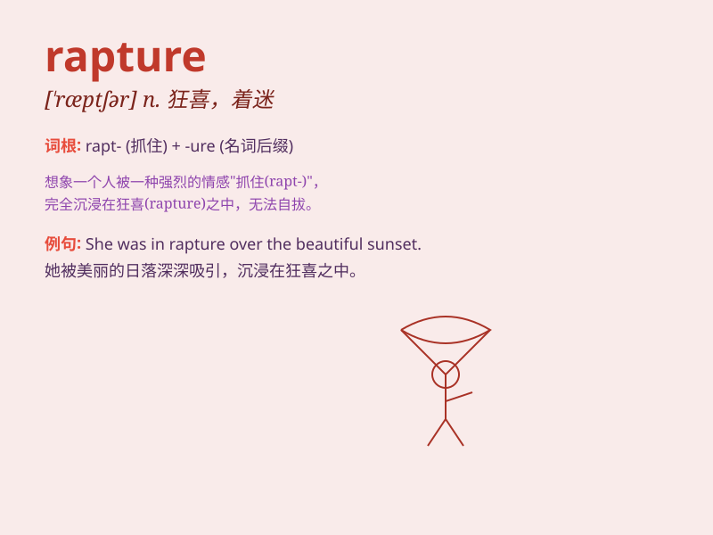

## rapture

**英音:** _[\'ræptʃə]_ **美音:** _[\'ræptʃɚ]_

**译义:** *n.全神贯注,兴高采烈,欢天喜地vt.使狂喜*

### 短语

+ **spiritual rapture:** _精神上的狂喜_

+ **in rapture:** _处于狂喜状态_

+ **rapture of the deep:** _深海晕眩_

+ **feel rapture:** _感到狂喜_

+ **rapture over sth:** _因某事而欣喜若狂_

### 例句

#### 例句1

> **The children were in rapture as they opened their presents on
Christmas morning.**

**中文翻译:** 孩子们在圣诞节早上打开礼物时欣喜若狂。

**单词释义:** 狂喜；兴高采烈

#### 例句2

> **She listened to the music with rapture.**

**中文翻译:** 她陶醉地听着音乐。

**单词释义:** 陶醉；入迷

#### 例句3

> **His face showed rapture when he saw his long-lost friend.**

**中文翻译:** 当他见到失散已久的朋友时，脸上露出了极度欢喜的神情。

**单词释义:** 极度欢喜

### 背诵小故事

> A little girl was lost in the forest. When her parents finally found
her, she felt a great rapture. It was like a magical moment of extreme
joy and happiness.

**一个小女孩在森林里迷路了。当她的父母最终找到她时，她感到极度的欣喜。这就像是一个充满极度喜悦和幸福的神奇时刻。**

### 图义

