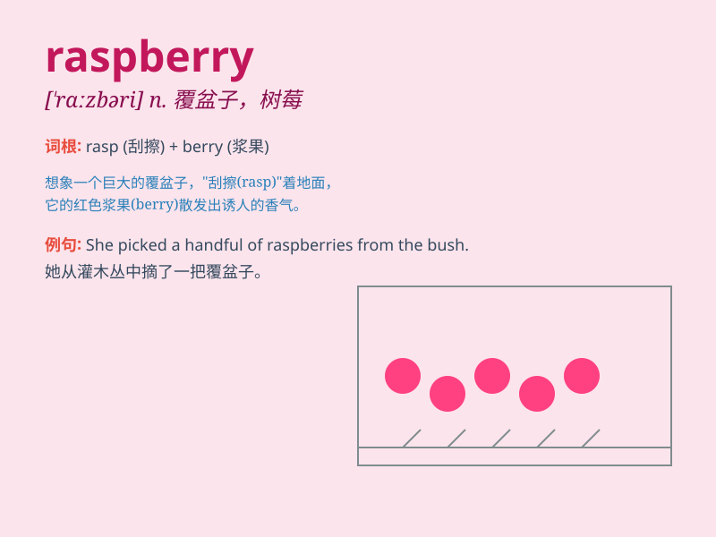

## raspberry

**英音:** _[\'rɑːzb(ə)rɪ]_ **美音:** _[ˈræzberɪ;
ræzˌbɛrɪ]_

**译义:** *n.悬钩子,\<俚>(表示轻蔑、嘲笑等的)咂舌声*

### 短语

+ **raspberry jam:** _树莓果酱_

+ **raspberry bush:** _覆盆子灌木丛_

+ **wild raspberry:** _野生覆盆子_

+ **raspberry ripple:** _树莓波纹_

+ **raspberry flavor:** _覆盆子口味_

### 例句

#### 例句1

> **I love the taste of fresh raspberries.**

**中文翻译:** 我喜欢新鲜覆盆子的味道。

**单词释义:** 覆盆子

#### 例句2

> **She picked a basket of raspberries from the garden.**

**中文翻译:** 她从花园里摘了一篮子覆盆子。

**单词释义:** 覆盆子

#### 例句3

> **The raspberry jam is very delicious.**

**中文翻译:** 覆盆子果酱非常美味。

**单词释义:** 覆盆子

### 背诵小故事

> One day, I went to a farm and saw many raspberry bushes. The
raspberries were bright red and looked so delicious. I picked some and
tasted them. Their sweet and tangy flavor made me remember the word
\'raspberry\' forever.

**有一天，我去了一个农场，看到了许多覆盆子灌木丛。覆盆子鲜红鲜红的，看起来十分美味。我摘了一些品尝。它们酸甜的味道让我永远记住了'raspberry'这个单词。**

### 图义

