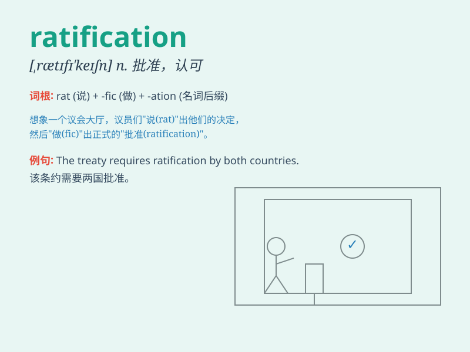

## ratification

**英音:** _[ˌrætɪfɪˈkeɪʃn]_ **美音:** _[ˌrætɪfɪˈkeɪʃn]_

**译义:** *n.批准*

### 短语

+ **treaty ratification:** _条约批准_

+ **ratification process:** _批准程序_

+ **await ratification:** _等待批准_

+ **ratification vote:** _批准投票_

+ **ratification agreement:** _批准协议_

### 例句

#### 例句1

> **The ratification of the treaty was a significant event in
international relations.**

**中文翻译:** 该条约的批准在国际关系中是一个重大事件。

**单词释义:** 批准；认可

#### 例句2

> **The ratification process took longer than expected.**

**中文翻译:** 批准过程比预期的要长。

**单词释义:** 批准；核准

#### 例句3

> **We are awaiting the ratification of the new law.**

**中文翻译:** 我们正在等待新法律的批准。

**单词释义:** 批准；正式认可

### 背诵小故事

> A king was considering ratification of a new law. His advisers
presented many reasons. Finally, he signed, giving his approval and
making the law valid. Ratification means the official approval or
confirmation.

**一位国王正在考虑批准一项新法律。他的顾问们给出了很多理由。最后，他签字了，给予了认可，使该法律生效。Ratification
意思是正式批准或确认。**

### 图义

