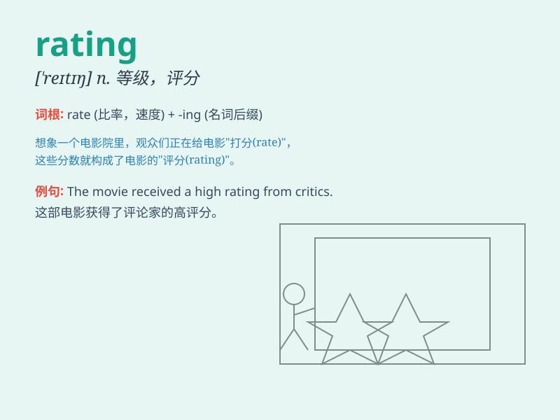

## rating

**英音:** _[\'reɪtɪŋ]_ **美音:** _[\'retɪŋ]_

**译义:** *n.等级级别(尤指军阶),额定,责骂,申斥*

### 短语

+ **credit rating:** _信用评级_

+ **customer rating:** _客户评级_

+ **rating system:** _评级系统_

+ **performance rating:** _绩效评级_

+ **rating scale:** _评定量表；等级量表_

### 例句

#### 例句1

> **The movie received a high rating from critics.**

**中文翻译:** 这部电影获得了评论家的高评分。

**单词释义:** 评分；等级

#### 例句2

> **Her performance rating at work has improved significantly this
year.**

**中文翻译:** 她今年在工作中的表现评级有了显著提高。

**单词释义:** 评级；评定等级

#### 例句3

> **The credit rating agency downgraded the company\'s rating.**

**中文翻译:** 信用评级机构降低了该公司的评级。

**单词释义:** 评级

### 背诵小故事

> A group of friends were comparing their skills in a game. They gave
each other a rating based on performance. The higher the rating, the
better they played. So, \'rating\' is like a score or evaluation.

**一群朋友在比较他们在游戏中的技能。他们根据表现给彼此打分。分数越高，玩得越好。所以，\'rating\'就像是分数或评价。**

### 图义

